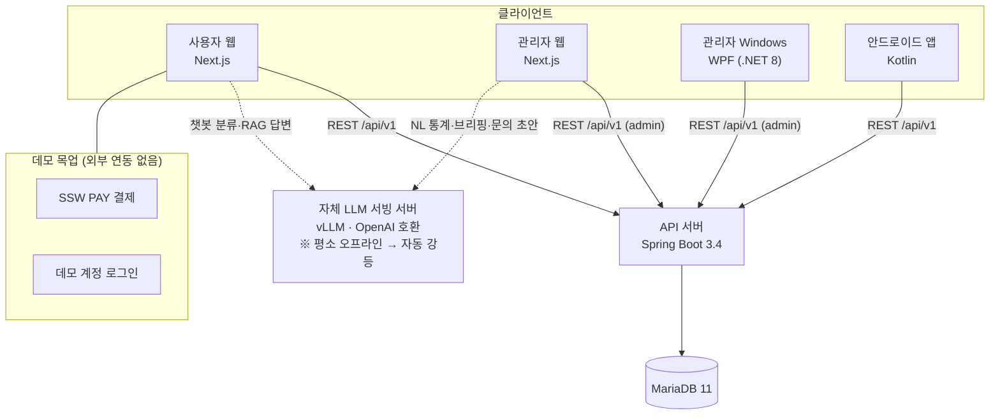

# SSW E-Commerce Demo — 문서·아키텍처 공개본

> 이 레포는 SSW 이커머스 데모의 **문서·아키텍처 공개본**입니다.
> 전체 구현(서버 · 사용자 웹 · 관리자 웹 · Windows 앱 · Android 앱 5개 레포)은
> 비공개로 관리되며, 여기에는 기획·설계 문서와 다이어그램만 담았습니다.

멀티플랫폼 이커머스 데모의 설계 기록입니다. 표면은 종합몰이지만 실제 목적은
**멀티플랫폼 구현 역량과 AI 오케스트레이션 개발 방식을 보여주는 포트폴리오**입니다.

> ⚠️ 시연용 데모입니다. 등장하는 **상품·가격·주문·리뷰·계정은 전부 예시 시드 데이터**이고,
> 결제(SSW PAY)·소셜 로그인·배송사 연동 등 **외부 연동은 전부 목업**이라 실제 외부
> 시스템으로 나가는 호출은 하나도 없습니다.

## 시스템 구성

실선은 데모 동작에 반드시 필요한 경로, 점선은 **없어도 기능이 강등된 채로 동작**하는
선택 경로입니다. 상세는 [시스템 아키텍처 문서](docs/architecture/01-system-architecture.md).

## 스택

| 딜리버러블 | 역할 | 스택 | 포트 |
|---|---|---|---|
| 서버 | 백엔드 API(`/api/v1`) — 인증·주문·상품·포인트·쿠폰·알림 | Java 17 · Spring Boot 3.4 · JPA · MariaDB 11 |
| 사용자 웹 | 고객 화면 — 카탈로그·주문·마이페이지·챗봇 | Next.js 16 · React 19 · TypeScript · Tailwind v4 |
| 관리자 웹 | 대시보드·주문/리뷰/문의/상품 운영·AI 실험실 | Next.js 16 · React 19 · TypeScript · Tailwind v4 |
| 관리자 Windows | 직원용 데스크톱 관리 앱 | WPF(`net8.0-windows`) · .NET 8 · MVVM(CommunityToolkit) |
| 안드로이드 | 고객 앱 — WebView 앱 셸 + 네이티브 하단 네비게이션 | Kotlin · Gradle |

클라이언트 4종이 **하나의 백엔드**(`/api/v1`)를 공유하고, 인증은 JWT + 역할 게이트
(`CUSTOMER` · `ADMIN` · `SELLER_SUPPORT` · `CUSTOMER_SUPPORT`)로 통일했습니다.

## 기능 하이라이트

**고객 웹** — 카탈로그(그리드/리스트 전환 애니메이션), 상품 상세(리뷰·포토 리뷰 라이트박스·관련
상품), 장바구니, 주문/결제(SSW PAY 목업), 주문 상세 타임라인, 배송지 관리(자동 채움), 알림함,
1:1 문의, 찜, 포인트·쿠폰, 매장 안내, 플로팅 메뉴(레이아웃 × 등장 효과 설정), 다크/라이트 +
accent 6종 테마.

**관리자 웹** — 대시보드(매출·추이), 주문 칸반, 리뷰 블라인드, 문의 답변, 상품 CRUD,
커맨드 팔레트(Ctrl+K), CSV 내보내기, 재고 위젯, 감사 로그, 주문 상태 변경 히트맵, 라이브 시연 모드.

**관리자 Windows (WPF)** — 로그인 창 + 메인 창 7개 탭(대시보드 · 주문 · 상품 · 리뷰 · 매장 ·
문의 · 감사로그). 관리자 웹과 같은 백엔드를 바라보며 **역할별 쓰기 권한 차이**를 그대로 반영합니다.

**안드로이드** — 사용자 웹을 감싸는 WebView 앱 셸에 네이티브 하단 탭 5종을 얹고, 웹 SPA 라우팅과
탭 상태를 브릿지로 동기화합니다. 라우트·URL 처리 정책과 만보기 계산 규칙은 순수 함수로 분리해
JVM 단위 테스트로 검증합니다.

**AI 기능** — 챗봇(키워드 프리필터 → 분류 게이트 → 미니 RAG → 답변 생성 4단계), 자연어 통계
실험실(NL→SQL, 가드 통과 후 실행), AI 브리핑, 문의 답변 초안. LLM 서버는 **평소 꺼진 상태가
기본**이고, 응답이 없으면 네 기능 모두 규칙 기반 **오프라인 폴백으로 자동 강등**되어 시연이 끊기지
않습니다. 챗봇에는 세션당 대화 회수 제한이 붙어 있는데, 잔여 회수를 클라이언트가 아니라 **서버가
정본으로 들고 있어** 관리자가 값을 조정하면 고객이 새로고침하지 않아도 다음 메시지부터 반영됩니다.

**상담원 연결** — 챗봇에서 상담사 **1:1 실시간 채팅**으로 넘어갈 수 있습니다. 연결 앞에 필수 문진
(카테고리 → 관련 주문 → 상세 설명)을 두어 유입을 조절하면서 상담원이 첫 줄부터 맥락을 갖고 시작하게
하고, 대기·진행 상태는 위젯을 닫았다 열어도 복원됩니다. 채팅 자체는 목업이 아니라 공용 인프라
chat-server에 위임한 실동작 연동입니다.

**리워드** — 포인트 원장(`point_ledger`)이 언제나 진실이고 잔액 컬럼은 같은 트랜잭션에서 갱신되는
캐시입니다. 멤버십 등급 산정, 만보기(걸음수) 미션, 가입 웰컴 혜택이 이 원장 위에 얹힙니다.

**데이터 규모** — 상품 50종, 카테고리 2-depth(대분류 12 · 소분류 49), 시드 주문 320건(최근 90일 분산).

## 다이어그램

모든 다이어그램은 **실제 소스와 대조해** 그렸고, 설계 문서와 구현이 어긋난 지점은 각 문서에
"구현 주의"로 표시했습니다.

### 바운디드 컨텍스트 경계

### 주문 상태머신

### 챗봇 파이프라인

### 태스크 → 구현 → 검증 루프

전체 SVG 21장은 [`docs/architecture/assets/diagrams/`](docs/architecture/assets/diagrams/)에
문서명-순번으로 들어 있습니다.

## 개발 방식 — 멀티 에이전트 협업

이 데모는 여러 AI 에이전트 세션이 나눠 만들었습니다. 규약의 핵심은 하나 — **구현과 검증을
분리한다**는 것입니다. 한쪽이 구현하면 검증은 다른 세션이 맡고, 검증에서 실패가 나오면 검증
세션이 직접 고치지 않고 실패 항목만 구현 쪽에 돌려보냅니다. 같은 세션이 자기 코드를 검증하면
구현할 때 한 착각을 검증에서도 그대로 반복하기 때문입니다. 반대 방향 제약도 있습니다 — 구현
보고는 "기동 확인" 수준까지만 적고 요구사항 충족 판정은 내리지 않습니다. 구현 쪽이 먼저 판정을
내려버리면 검증이 그 결론을 따라가기 때문입니다. 세션 간 소통은 **파일 기반 협업 프로토콜**로
하고(보낸 메시지는 수정하지 않고 정정도 새 메시지로), 태스크 문서의 "완료 기준(검증 항목)" 절이
그대로 검증 체크리스트가 됩니다.

자세한 규약과 다이어그램은 [검증 파이프라인 문서](docs/architecture/08-verification-pipeline.md)에 있습니다.

## 문서

| 경로 | 내용 |
|---|---|
| [`docs/architecture/01-system-architecture.md`](docs/architecture/01-system-architecture.md) | 전체 구성 · 구성 요소 · 인증 흐름 · 챗봇 파이프라인 |
| [`docs/architecture/02-data-model-erd.md`](docs/architecture/02-data-model-erd.md) | 전체 ERD · 바운디드 컨텍스트 경계와 논리 참조 |
| [`docs/architecture/03-order-flow.md`](docs/architecture/03-order-flow.md) | 주문 상태머신 · SSW PAY 결제 시퀀스 · 취소 원복 |
| [`docs/architecture/04-review-flow.md`](docs/architecture/04-review-flow.md) | 리뷰 라이프사이클 · 작성 자격 검증 |
| [`docs/architecture/05-reward-flows.md`](docs/architecture/05-reward-flows.md) | 멤버십 등급 산정 · 만보기 미션 · 가입 웰컴 혜택 |
| [`docs/architecture/06-ops-flows.md`](docs/architecture/06-ops-flows.md) | 재고 임계 알림 래치 · 관리 행위 감사 기록 · 주문확인 메일 · 챗봇 대화 회수 관리 |
| [`docs/architecture/07-auth-and-chatbot.md`](docs/architecture/07-auth-and-chatbot.md) | JWT 인증·역할 게이트 · 소셜 가상 로그인 · 챗봇 파이프라인 · 대화 회수 · 상담원 연결 (구현 수준) |
| [`docs/architecture/08-verification-pipeline.md`](docs/architecture/08-verification-pipeline.md) | 태스크→구현→검증 루프 · 인박스 협업 프로토콜 |
| [`docs/architecture/09-infra-integration.md`](docs/architecture/09-infra-integration.md) | 공용 인프라 위임 — 인증 강등 · 이미지 파이프라인 · 관리자 업로드 |
| [`docs/planning/01-project-brief.md`](docs/planning/01-project-brief.md) | 프로젝트 목적 · 메인 포인트 · 확정 사항 |
| [`docs/planning/02-scope.md`](docs/planning/02-scope.md) | 플랫폼 범위 · P0~P2 · Out-of-Scope |
| [`docs/requirements/01-functional.md`](docs/requirements/01-functional.md) | 기능 요구사항 |
| [`docs/requirements/02-non-functional.md`](docs/requirements/02-non-functional.md) | 비기능 요구사항 |
| [`docs/requirements/03-user-stories.md`](docs/requirements/03-user-stories.md) | 유저 스토리 |
| [`docs/planning/03-glossary.md`](docs/planning/03-glossary.md) | 용어집 |
| [`docs/demo-scenario.md`](docs/demo-scenario.md) | 5분/15분 시연 대본 |

원본 워크스페이스는 SDLC-7(01-planning ~ 07-maintenance) 구조로 문서를 관리하며, 이 공개본에는
그중 기획·요구사항·설계 영역을 실었습니다. 배포·유지보수 문서는 포함하지 않습니다.

---

내부 도메인·자격증명 등 공개에 부적절한 값은 플레이스홀더로 치환했습니다.
