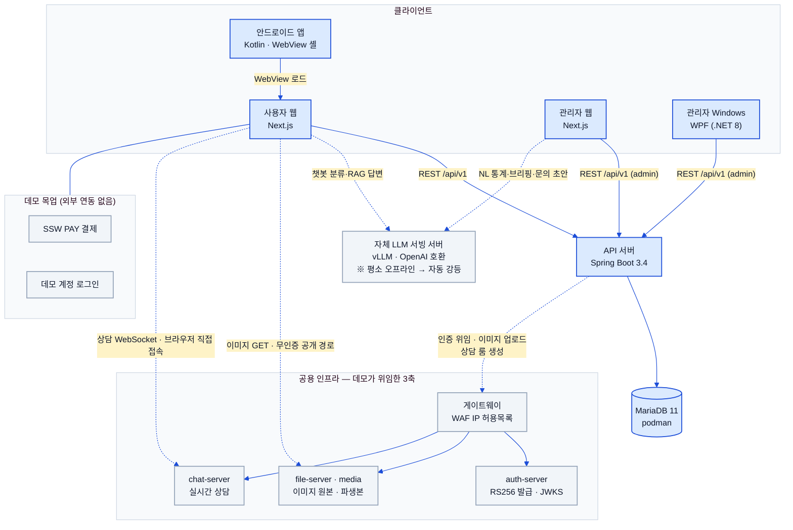
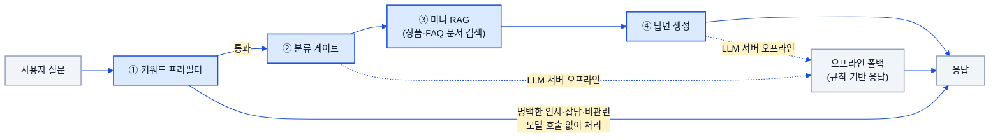

# 시스템 아키텍처 (System Architecture)

> 상태: ✅ 확정 · 최종수정: 2026-08-02

클라이언트 4종 · API 서버 1종 · MariaDB · 외부 LLM 서빙으로 구성된 데모의 전체 구조를 정의한다.
데이터 스키마 정본은 내부 데이터 모델 설계 문서(비공개)이며, 이 문서는 **구성 요소와 그 사이의 통신**을 다룬다.
개별 도메인의 상태머신·시퀀스는 종류별 다이어그램 문서로 분리했다(§5).

---

## 1. 전체 구성도



실선은 데모 동작에 반드시 필요한 경로, 점선은 **없어도 기능이 강등된 채로 동작**하는 선택 경로다.
공용 인프라가 점선인 것도 같은 이유다 — 인증은 로컬 HS256으로, 이미지는 로컬 정적으로 자동 강등된다
([`09-infra-integration.md`](09-infra-integration.md) §1). 안드로이드 앱은 서버를 직접 부르지 않고
사용자 웹을 WebView로 싣는 셸이라 API 화살표가 웹에서만 나간다(§2.4).

---

## 2. 구성 요소

### 2.1 사용자 웹 (`ssw-e-commerce-demo-web`)

Next.js 16 App Router · React 19 · TypeScript · Tailwind v4. 고객이 보는 모든 화면을 담당한다.
카탈로그·상품 상세·장바구니·주문·마이페이지·알림함·문의·챗봇 셸이 여기 있다.
프로토타입(`design/prototype`)의 시각·구조를 그대로 재현하는 것이 완료 기준이며,
페이지 전환 애니메이션과 오버레이로 앱형 UX를 낸다.

### 2.2 관리자 웹 (`ssw-e-commerce-demo-admin-web`)

같은 스택(Next.js 16 · React 19 · Tailwind v4)에 디자인 토큰을 사용자 웹과 공유한다.
staff 역할(`ADMIN`·`SELLER_SUPPORT`·`CUSTOMER_SUPPORT`)만 로그인할 수 있고, `CUSTOMER`는 거부된다.
대시보드·주문 칸반·리뷰 블라인드·문의 답변·상품 CRUD 같은 운영 화면과,
LLM 서버를 쓰는 실험실(자연어 통계)·AI 브리핑·문의 초안이 함께 들어 있다.

### 2.3 관리자 Windows (`ssw-e-commerce-demo-admin-windows`)

WPF · .NET 8 · MVVM(CommunityToolkit) 데스크톱 앱. PC 네이티브 관리 역량 시연이 목적이다.
서버와는 관리자 웹과 동일한 `/api/v1` 관리자 엔드포인트로 통신한다.
로그인 후 대시보드·주문·문의 탭을 제공하는 최소 구성이며, 기능 확장 폭은 관리자 웹보다 좁다.

### 2.4 안드로이드 앱 (`ssw-e-commerce-demo-android`)

Kotlin 기반. 사용자 웹을 WebView로 감싸는 **앱 셸** 구조에 네이티브 하단
네비게이션 바를 얹었다. 화면 자체는 웹이 그리고, 앱은 셸·네비게이션·네이티브 기능
연결 지점을 맡는다. 현재는 단일 `MainActivity` 중심의 최소 구현 단계다.

### 2.5 API 서버 (`ssw-e-commerce-demo-server`)

Java 17 · Spring Boot 3.4 · Spring Data JPA. 모든 클라이언트가 바라보는 단일 백엔드로,
경로는 `/api/v1` 하나로 통일한다. 인증(JWT), 주문 상태머신과 채번, 포인트 원장,
쿠폰 지갑, 알림 훅, 파일 메타를 담당하며, 예외는 `ErrorCode` + `BusinessException`으로
표준화해 클라이언트가 코드로 분기할 수 있게 한다.

### 2.6 MariaDB 11 (podman)

로컬 개발에서는 podman 컨테이너로 띄운다. 스키마 정본은 내부 데이터 모델 설계 문서(비공개).
운영 프로파일은 `ddl-auto=validate`이므로 엔티티 변경이 DB에 자동 반영되지 않는다 —
`server/db/migrations/`의 SQL을 **파일명(날짜) 순서대로 수동 적용**하는 것이 관례다.

### 2.7 자체 LLM 서빙 서버 (vLLM)

OpenAI 호환 API로 gemma 26B(reasoning)를 서빙한다. **평소에는 꺼져 있는 것이 기본 상태**이고
오너가 필요할 때만 켠다. 모델 식별은 하드코딩하지 않고 `/v1/models`로 감지한다.
사용처는 사용자 웹 챗봇과 관리자 웹의 실험실·AI 브리핑·문의 초안이며,
어느 쪽이든 응답이 없으면 오프라인 폴백으로 자동 강등된다(§4).

### 2.8 목업: SSW PAY · 데모 로그인

**SSW PAY**는 가상 PG 모달이다. 승인·실패·취소 세 결과를 사용자가 골라 시연할 수 있고,
실제 결제사로 나가는 호출은 없다. **데모 로그인**도 시드로 심어둔 데모 계정
(`customer@demo.ssw`, `admin@demo.ssw` 등)을 쓰며, 소셜 로그인·외부 IdP 연동은 없다.
로그인 화면에서 계정 칩을 클릭하면 입력란이 자동으로 채워진다.

---

## 3. 인증 흐름 (JWT)

목업 헤더(`X-Demo-User`)로 사용자를 식별하던 초기 방식은 **폐기**되었고, 현재는 실제 JWT로 이관된 상태다.
비밀번호는 BCrypt로 저장한다. 토큰 클레임·경로별 권한 규칙·401/403 구분 등 구현 수준 상세는
[`07-auth-and-chatbot.md`](07-auth-and-chatbot.md) §1이 정본이다.

> 현재 **기본 경로는 공용 인프라 auth 위임(RS256)** 이고, 아래 로컬 HS256 발급은 인프라 불통 시의
> 폴백으로 남아 있다. 위임·강등 구조는 [`09-infra-integration.md`](09-infra-integration.md) §2가 정본이다.

```
로그인 (email + password)
   → 서버가 자격 검증 후 JWT 발급 (role 클레임 포함)
   → 클라이언트가 이후 요청의 Authorization 헤더에 Bearer 토큰으로 첨부
   → 서버가 토큰 검증 후 role 기반으로 엔드포인트 접근 제어
```

| Role | 용도 |
|---|---|
| `CUSTOMER` | 고객. 사용자 웹·안드로이드 앱 |
| `ADMIN` | 관리자 전권 |
| `SELLER_SUPPORT` | 판매지원. admin-windows 주 사용 |
| `CUSTOMER_SUPPORT` | 고객지원(문의 답변 등). admin-web 주 사용 |

- 일반 회원가입으로 만들어지는 계정의 role은 항상 `CUSTOMER`로 고정된다.
  staff 계정은 시드 또는 `ADMIN` 권한자의 별도 발급 경로로만 생긴다.
- 관리자 웹·관리자 Windows는 staff role만 통과시키고, `CUSTOMER` 토큰은 로그인 단계에서 거부한다.
- 토큰 만료(`JWT_EXPIRATION_MS`)·서명 키(`JWT_SECRET`)는 환경변수로 주입한다(값은 레포에 두지 않는다).
- 소셜 로그인 4종(네이버·카카오·Google·Meta)은 **실제 OAuth2 연동이 아니라 가상 로그인 모달**이고,
  승인하면 데모 계정으로 실제 JWT 로그인이 일어난다([`07-auth-and-chatbot.md`](07-auth-and-chatbot.md) §2).
  로그인·가입 성공 후 목적지는 메인(`/`)이다.

---

## 4. 챗봇 파이프라인

사용자 웹 챗봇은 모든 입력을 LLM에 그대로 던지지 않는다. 값싼 단계로 먼저 걸러내고,
꼭 필요한 경우에만 모델을 호출하는 4단계 구성이다.
아래는 개념도이며, 세션 한도·타임아웃·폴백 분기까지 그린 구현 수준 다이어그램은
[`07-auth-and-chatbot.md`](07-auth-and-chatbot.md) §3에 있다.



1. **키워드 프리필터** — 명백한 인사·잡담·비관련 입력을 모델 호출 없이 처리한다.
2. **분류 게이트** — 질문 의도를 분류해 어떤 경로(상품 추천 / 주문 문의 / 일반 안내)로 보낼지 정한다.
3. **미니 RAG** — 상품·FAQ 등 데모 범위 안의 문서에서 관련 조각을 뽑아 컨텍스트로 붙인다.
4. **답변 생성** — 컨텍스트를 붙여 LLM 서버에 최종 답변을 요청한다.

**자동 강등**: LLM 서버가 꺼져 있거나 응답하지 않으면 ②·④ 어느 단계에서든 오프라인 폴백으로 내려간다.
폴백은 규칙 기반 응답이라 품질은 낮지만, 챗봇 UI 자체는 계속 살아 있어 시연이 끊기지 않는다.
관리자 웹의 실험실·AI 브리핑·문의 초안도 같은 강등 원칙을 따른다 — LLM 서버가 꺼진 평소 상태에서는
폴백 범위에서만 동작한다.

> 자연어 통계(실험실)는 NL→SQL을 그대로 실행하지 않고 **가드를 거친 뒤 실행**한다.
> 가드 규칙의 상세는 admin-web 구현을 정본으로 본다.

챗봇에는 위 4단계 외에 **세션당 대화 회수 제한**(서버 `chat_usage`가 정본, 관리자가 실시간 조정)과
**상담원 실시간 채팅으로의 전환**(연결 전 필수 문진)이 붙어 있다. 둘 다
[`07-auth-and-chatbot.md`](07-auth-and-chatbot.md) §4~§6이 정본이고, 상담 채팅의 인프라 접점은
[`09-infra-integration.md`](09-infra-integration.md) §5가 다룬다.

---

## 5. 다이어그램 문서

도메인별 상태머신·시퀀스·플로우차트는 종류별로 나눠 두었다. 모든 다이어그램은 **실제 소스와 대조**해
그렸고, 설계 문서와 구현이 어긋난 지점은 각 문서에 "구현 주의"로 표시했다.

| 문서 | 담는 다이어그램 |
|---|---|
| [`02-data-model-erd.md`](02-data-model-erd.md) | 전체 ERD · 바운디드 컨텍스트 경계와 논리 참조 |
| [`03-order-flow.md`](03-order-flow.md) | 주문 상태머신 · SSW PAY 결제 시퀀스 · 취소 원복 |
| [`04-review-flow.md`](04-review-flow.md) | 리뷰 라이프사이클 · 작성 자격 검증 |
| [`05-reward-flows.md`](05-reward-flows.md) | 멤버십 등급 산정 · 만보기 미션 · 가입 웰컴 혜택 |
| [`06-ops-flows.md`](06-ops-flows.md) | 재고 임계 알림 래치 · 관리 행위 감사 기록 · 주문확인 메일 · 챗봇 대화 회수 관리 |
| [`07-auth-and-chatbot.md`](07-auth-and-chatbot.md) | JWT 인증·역할 게이트 · 소셜 가상 로그인 · 챗봇 파이프라인 · 대화 회수 · 상담원 연결 (§3·§4 확장) |
| [`08-verification-pipeline.md`](08-verification-pipeline.md) | 태스크→구현→검증 루프 · 인박스 협업 프로토콜 |
| [`09-infra-integration.md`](09-infra-integration.md) | 공용 인프라 위임 — 인증 강등 · 이미지 파이프라인 · 관리자 업로드 |

다이어그램은 **mermaid 인라인 단일 체계**다 — 깃허브가 코드펜스를 그대로 렌더하므로 이미지 익스포트를
따로 두지 않는다. 정본은 언제나 문서 본문의 mermaid 블록 하나뿐이라 그림과 글이 어긋날 자리가 없다.

> **다이어그램 테마 유지보수**: 모든 mermaid 블록 첫 줄의 `%%{init: ...}%%` 디렉티브는 동일한 문자열이다.
> 브랜드 색이나 폰트를 바꿀 때는 이 폴더의 `0[1-9]-*.md` 전 파일과 **루트 `README.md`** 에서
> 해당 줄을 **일괄 치환**한다.
