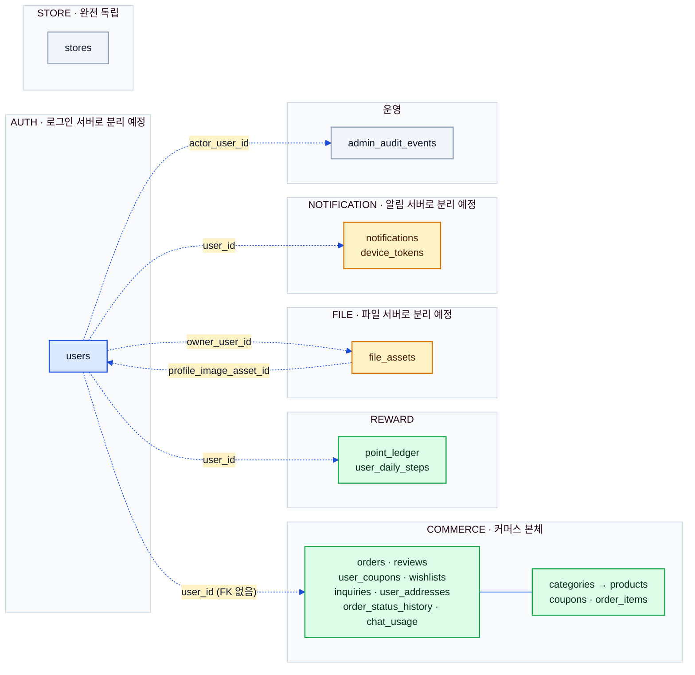

# 데이터 모델 ERD (Data Model ERD)

> 상태: ✅ 확정 · 최종수정: 2026-08-06

내부 데이터 모델 설계 문서(비공개)가 정의한 스키마를 **관계 다이어그램**으로 옮긴 문서다.
컬럼 정본·정책 서술은 그쪽이 기준이고, 이 문서는 **엔티티가 서로 어떻게 물려 있는지**만 다룬다.
다이어그램은 서버 엔티티(`ssw-e-commerce-demo-server/.../domain/*.java`)의 실제 매핑을 대조해 그렸다.

---

## 1. 전체 관계도

```mermaid
%%{init: {"theme":"base","fontFamily":"Pretendard, Malgun Gothic, sans-serif","themeVariables":{"fontSize":"14px","primaryColor":"#DBEAFE","primaryBorderColor":"#1D4ED8","primaryTextColor":"#0F172A","lineColor":"#1D4ED8","secondaryColor":"#FEF3C7","tertiaryColor":"#DCFCE7","clusterBkg":"#F8FAFC","clusterBorder":"#CBD5E1","noteBkgColor":"#FEF3C7","noteBorderColor":"#D97706","actorBkg":"#DBEAFE","actorBorder":"#1D4ED8","actorTextColor":"#0F172A","signalColor":"#1D4ED8","signalTextColor":"#0F172A","labelBoxBkgColor":"#DBEAFE","labelBoxBorderColor":"#1D4ED8","altSectionBkgColor":"#F8FAFC"},"flowchart":{"curve":"basis","htmlLabels":true,"padding":12}}}%%
%% 공통 브랜드 테마 — architecture/*.md 전 다이어그램에 동일한 init 블록이 들어간다. 색을 바꿀 때는 이 폴더 전 파일을 일괄 치환할 것.
erDiagram
    users ||..o{ orders : "논리참조 user_id"
    users ||..o{ reviews : "논리참조 user_id"
    users ||..o{ user_coupons : "논리참조 user_id"
    users ||..o{ user_addresses : "논리참조 user_id"
    users ||..o{ inquiries : "논리참조 user_id"
    users ||..o{ point_ledger : "논리참조 user_id"
    users ||..o{ notifications : "논리참조 user_id"
    users ||..o{ device_tokens : "논리참조 user_id"
    users ||..o{ user_daily_steps : "논리참조 user_id"
    users ||..o{ wishlists : "논리참조 user_id"
    users ||..o{ admin_audit_events : "논리참조 actor_user_id"
    users ||..o{ file_assets : "논리참조 owner_user_id"
    users |o..o{ chat_usage : "논리참조 user_id (nullable)"
    file_assets |o..o| users : "논리참조 profile_image_asset_id"

    categories ||--o{ categories : "parent_id 자기참조 2-depth"
    categories ||--o{ products : "category_id (소분류만)"
    products ||--o{ product_colors : "@ElementCollection"
    products ||--o{ product_sizes : "@ElementCollection"
    products ||--o{ reviews : "product_id"
    products ||--o{ wishlists : "product_id"
    reviews ||--o{ review_images : "@ElementCollection"

    orders ||--o{ order_items : "@ElementCollection"
    orders ||--o{ order_status_history : "order_id"
    orders |o--o{ inquiries : "order_id (nullable)"
    orders |o--o{ user_coupons : "used_order_id (nullable)"
    coupons ||--o{ orders : "coupon_code (nullable)"
    coupons ||--o{ user_coupons : "coupon_code"
    products |o..o{ order_items : "product_id 스냅샷 (FK 없음)"

    users {
        bigint id PK ""
        varchar email UK "삭제 시 아카이빙"
        varchar email_original "원본 보관"
        varchar password_hash "BCrypt"
        varchar role "4종 · 표 참조"
        bigint profile_image_asset_id "논리참조"
        int points_balance "잔액 캐시"
        varchar status "3종 · 표 참조"
        datetime deleted_at ""
    }
    categories {
        int id PK ""
        varchar name "UK(parent_id,name)"
        int parent_id FK "NULL=대분류"
        int sort_order ""
        varchar status "ACTIVE HIDDEN DELETED"
    }
    products {
        int id PK "수동 채번"
        varchar name ""
        int category_id FK ""
        int price ""
        int sale "세일가 nullable"
        int stock ""
        boolean stock_low_alert_active "알림 래치"
        double rating "리뷰 평점 캐시"
        int reviews "리뷰 수 캐시"
        varchar status "ACTIVE HIDDEN DELETED"
        datetime created_at ""
    }
    orders {
        varchar id PK "ORD-YYYY-NNNNNN"
        bigint user_id "논리참조 AUTH 경계"
        varchar coupon_code FK "nullable"
        int coupon_discount ""
        int points_used ""
        int subtotal ""
        int shipping_fee ""
        int total ""
        varchar payment_method "3종 · 표 참조"
        varchar status "5종 · 표 참조"
        varchar tracking_no "shipped 시 입력"
        varchar carrier ""
        varchar addr_name "배송지 스냅샷 6컬럼"
        datetime created_at ""
    }
    order_items {
        varchar order_id FK "컬렉션 소유"
        int product_id "FK 없음·스냅샷"
        varchar product_name "주문 당시"
        int price "주문 당시"
        varchar color ""
        varchar size ""
        int qty ""
    }
    order_status_history {
        bigint id PK ""
        varchar order_id FK ""
        varchar from_status "최초 생성 시 NULL"
        varchar to_status ""
        bigint changed_by_user_id "논리참조 · 시스템은 NULL"
        varchar memo ""
        datetime created_at "시각 산출 근거"
    }
    reviews {
        bigint id PK ""
        int product_id FK ""
        bigint user_id "논리참조 AUTH 경계"
        varchar author_name "이름 스냅샷"
        int rating "1~5"
        text body ""
        varchar status "ACTIVE DELETED BLINDED"
        datetime created_at ""
    }
    review_images {
        bigint review_id FK "컬렉션 소유"
        varchar image_url "URL 단독(M1)"
    }
    point_ledger {
        bigint id PK ""
        bigint user_id "논리참조 AUTH 경계"
        int delta "+적립 -차감"
        varchar reason "7종 · 05-reward-flows 참조"
        varchar ref_id "주문 id · 날짜"
        datetime created_at "append-only"
    }
    coupons {
        varchar code PK ""
        varchar label ""
        varchar type "PERCENT AMOUNT"
        int value ""
        int min_order_amount ""
        varchar status "ACTIVE EXPIRED DELETED"
        datetime valid_from "NULL=즉시"
        datetime valid_until "NULL=무기한"
    }
    user_coupons {
        bigint id PK ""
        bigint user_id "논리참조 AUTH 경계"
        varchar coupon_code FK ""
        varchar source "4종 · 표 참조"
        varchar source_ref "발급근거"
        datetime issued_at ""
        datetime used_at "NULL=미사용"
        varchar used_order_id FK "nullable"
    }
    user_addresses {
        bigint id PK ""
        bigint user_id "논리참조 AUTH 경계"
        varchar label "집 회사 등"
        varchar name ""
        varchar phone ""
        varchar zip ""
        varchar address ""
        varchar detail ""
        boolean is_default ""
        varchar status "ACTIVE DELETED"
    }
    inquiries {
        bigint id PK ""
        bigint user_id "논리참조 AUTH 경계"
        varchar order_id FK "nullable"
        varchar type "5종 · 표 참조"
        varchar title ""
        text body ""
        varchar status "4종 · 표 참조"
        text answer_body ""
        bigint answered_by_user_id "논리참조 답변 스태프"
        datetime answered_at ""
    }
    notifications {
        bigint id PK ""
        bigint user_id "논리참조 AUTH 경계"
        varchar type "5종 · 표 참조"
        varchar title ""
        varchar body ""
        varchar ref_id "논리 참조"
        datetime read_at "NULL=미읽음"
        varchar status "SENT READ DELETED"
        datetime created_at ""
    }
    device_tokens {
        bigint id PK ""
        bigint user_id "논리참조 AUTH 경계"
        varchar token UK "푸시 등록 토큰"
        varchar platform "3종 · 표 참조"
        varchar status "ACTIVE REVOKED"
    }
    user_daily_steps {
        bigint id PK ""
        bigint user_id "UK(user_id,step_date)"
        date step_date ""
        int steps ""
        int goal_steps "목표 스냅샷"
        int reward_points "지급된 포인트"
        datetime goal_rewarded_at "래치"
        datetime updated_at ""
    }
    admin_audit_events {
        bigint id PK ""
        bigint actor_user_id "논리참조 행위자"
        varchar actor_name "스냅샷"
        varchar actor_role "역할 스냅샷"
        varchar type "10종 · 06-ops-flows 참조"
        varchar target_type "3종"
        varchar target_id ""
        varchar summary ""
        datetime created_at ""
    }
    file_assets {
        bigint id PK ""
        bigint owner_user_id "논리참조 AUTH 경계"
        varchar purpose "2종"
        varchar storage_key "파일서버 키"
        varchar content_type ""
        bigint byte_size ""
        varchar status "ACTIVE DELETED"
    }
    wishlists {
        bigint id PK ""
        bigint user_id "UK(user_id,product_id)"
        int product_id FK ""
        datetime created_at "실삭제 허용"
    }
    chat_usage {
        bigint id PK ""
        varchar session_key UK "UUID v4 · 쿠키가 싣는 유일한 값"
        bigint user_id "논리참조 AUTH 경계 · nullable"
        int used_count "소비한 대화 회수"
        int bonus_count "관리자 부여분"
        varchar last_ip "최근 접속 IP · nullable · X-Client-IP"
        datetime created_at ""
        datetime updated_at "최근 활동 정렬용"
    }
    stores {
        bigint id PK ""
        varchar name "완전 독립 테이블"
        double lat ""
        double lng ""
        varchar address ""
        varchar phone ""
        varchar hours ""
        varchar closed_days ""
        varchar status "ACTIVE CLOSED"
    }
```

**실선은 실제 FK, 점선은 FK 없는 논리 참조**다. 커머스 도메인 안(`products`↔`categories`, `reviews`→`products`,
`orders`→`order_items`)은 실제 FK로 묶여 있고, 미래 서비스 경계를 넘는 참조(`users`·`file_assets`·알림 계열)는
컬럼과 인덱스만 두고 FK를 걸지 않는다 — 로그인 서버·파일 서버·알림 서버를 떼어낼 때 제약 삭제 마이그레이션이
필요 없게 하려는 설계다(내부 데이터 모델 설계 문서 P1·P2). `stores`는 어느 쪽과도 연결되지 않는 완전 독립 테이블이라
관계선이 없다. `order_items.product_id`는 커머스 내부인데도 의도적으로 FK가 없는데, 주문 당시 값을 얼려두는
스냅샷이라 상품이 바뀌거나 숨겨져도 주문 이력이 흔들리면 안 되기 때문이다.

### 열거 값 (다이어그램에서 "N종 · 표 참조"로 줄인 것)

| 테이블.컬럼 | 값 |
|---|---|
| `users.role` | `CUSTOMER` · `ADMIN` · `SELLER_SUPPORT` · `CUSTOMER_SUPPORT` |
| `users.status` | `ACTIVE` · `SUSPENDED` · `DELETED` |
| `orders.status` | `pending` · `paid` · `shipped` · `delivered` · `cancelled` (**소문자**) |
| `orders.payment_method` | `card` · `transfer` · `phone` (**소문자**) |
| `point_ledger.reason` | `SIGNUP_BONUS` · `STEP_GOAL` · `STEP_REWARD`(미사용) · `ORDER_USE` · `ORDER_EARN` · `ORDER_REFUND` · `ADMIN_ADJUST` |
| `user_coupons.source` | `SIGNUP` · `STEP_MISSION`(미사용) · `ADMIN_ISSUE` · `CODE_REDEEM` |
| `inquiries.type` | `ORDER` · `DELIVERY` · `RETURN` · `PRODUCT` · `OTHER` |
| `inquiries.status` | `OPEN` · `ANSWERED` · `CLOSED` · `DELETED` |
| `notifications.type` | `ORDER_STATUS` · `STEP_MISSION` · `PROMOTION` · `INQUIRY_ANSWERED` · `STOCK_LOW` |
| `device_tokens.platform` | `ANDROID` · `IOS` · `WEB` |
| `admin_audit_events.target_type` | `REVIEW` · `PRODUCT` · `STORE` |
| `file_assets.purpose` | `REVIEW_IMAGE` · `PROFILE_IMAGE` |
| `categories.status` / `products.status` | `ACTIVE` · `HIDDEN` · `DELETED` |
| `reviews.status` | `ACTIVE` · `DELETED` · `BLINDED` |
| `coupons.status` / `.type` | `ACTIVE`·`EXPIRED`·`DELETED` / `PERCENT`·`AMOUNT` |

`admin_audit_events.type` 10종은 [`06-ops-flows.md`](06-ops-flows.md) §2,
`point_ledger.reason`의 발생 지점은 [`05-reward-flows.md`](05-reward-flows.md) §3 표를 본다.

---

## 2. AUTH 경계와 논리 참조

바운디드 컨텍스트를 색으로 갈랐다 — 파랑이 AUTH, 초록이 커머스 본체, 노랑이 나중에 테이블째 떼어낼 대상,
회색이 독립 영역이다. 점선 화살표는 전부 `users.id`를 향하는 논리 참조이고, 분리가 실제로 일어나면 이 화살표들이
DB 조인이 아니라 HTTP 호출이나 이벤트로 대체된다. `notifications`·`device_tokens`는 다른 테이블과 FK를
아예 맺지 않아 두 테이블만 들어내도 스키마가 성립한다. 반대로 `file_assets`와 `users`는 서로를 논리 참조하는
양방향 관계라(프로필 이미지 ↔ 소유자) 분리 시 양쪽 다 호출 경계가 생긴다.

---

## 3. 구현과 설계 문서가 어긋난 지점

다이어그램을 그리며 엔티티 코드와 내부 데이터 모델 설계 문서(비공개)를 대조한 결과 아래 차이를 확인했다.
데이터 모델 문서 개정 시 반영 대상이다.

| 항목 | 설계 문서(v2.1) | 실제 구현 |
|---|---|---|
| `review_images` | `file_asset_id` + `image_url` 병행 | **`image_url` 단독** (`Review.java` `@ElementCollection`) |
| `point_ledger.reason` | 6종 | **7종** — `STEP_GOAL` 추가 |
| `products` | — | **`stock_low_alert_active`** 추가(재고 임계 알림 래치, §[`06-ops-flows.md`](06-ops-flows.md)) |
| `inquiries` | 타입 컬럼 없음 | **`type`** 추가 (`ORDER`·`DELIVERY`·`RETURN`·`PRODUCT`·`OTHER`) |
| `notifications.type` | 3종 예시 | **5종** — `INQUIRY_ANSWERED`·`STOCK_LOW` 추가 |
| `stores` | `hours`까지 | **`closed_days`·안내문** 추가 |
| 채번 | 시퀀스 테이블 권고 | **`order_seq(seq_year PK, next_val)`** 로 구현 |
| 멤버십 | 문서에 없음 | **`MembershipTier`** 신설(§[`05-reward-flows.md`](05-reward-flows.md)) |
| 감사 로그 | 문서에 없음 | **`admin_audit_events`** 신설(§[`06-ops-flows.md`](06-ops-flows.md)) |
| 만보기 | 문서에 없음 | **`user_daily_steps`** 신설(§[`05-reward-flows.md`](05-reward-flows.md)) |
