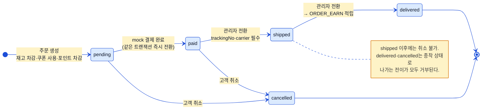
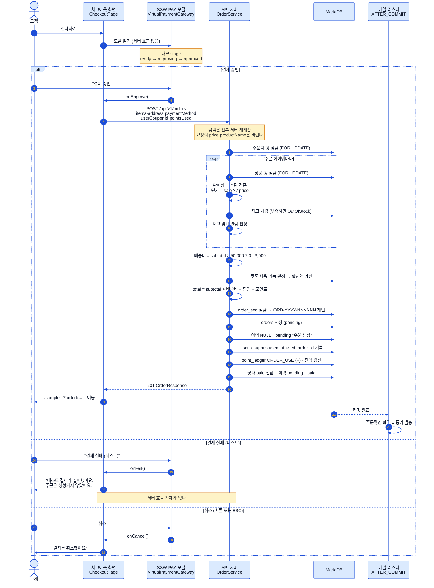
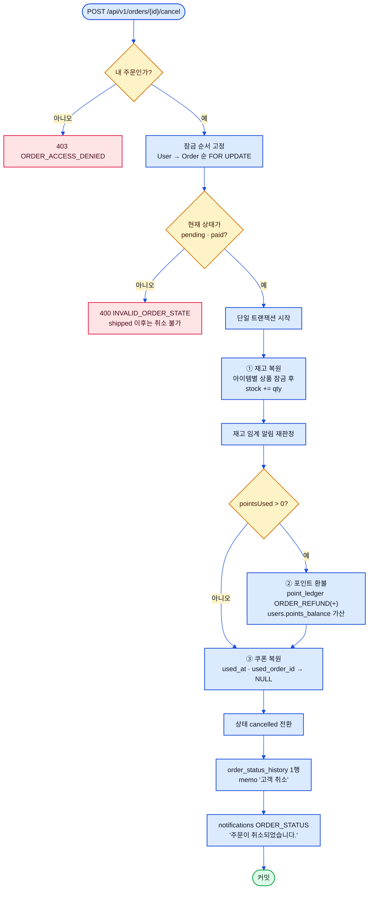

# 주문·결제 플로우 (Order & Payment Flow)

> 상태: ✅ 확정 · 최종수정: 2026-08-02

주문 상태머신, SSW PAY 가상 결제, 취소 원복 세 갈래를 다룬다.
정책 서술은 내부 데이터 모델 설계 문서(비공개) §3.4를 따르되, 이 문서의 다이어그램은
`OrderService`·`VirtualPaymentGateway` 구현을 그대로 옮긴 것이라 **구현이 문서와 다른 지점도 그린다**.

---

## 1. 주문 상태머신

`Order.Status`는 **소문자 5종**(`pending`·`paid`·`shipped`·`delivered`·`cancelled`)이고, 전이 판정은
`OrderService.validateTransition()` 한 곳에 모여 있다. 허용되지 않는 전이는 `InvalidOrderStateException`으로
막히고 HTTP 400 `INVALID_ORDER_STATE`가 나간다 — 건너뛰기(`pending→shipped`, `paid→delivered`)도 같이 거부된다.
`paid→shipped` 전환에는 `trackingNo`·`carrier`가 둘 다 있어야 하며, 하나라도 비면 같은 예외로 거부된다.

> ⚠️ **구현 주의**: 주문 생성은 `pending`으로 저장한 뒤 **같은 트랜잭션 안에서 곧바로 `paid`로 바꾼다**(mock 결제).
> 이 전환만 `validateTransition`을 타지 않으며, `order_status_history`에는 `NULL→pending`("주문 생성")과
> `pending→paid`("mock 결제 완료") 두 행이 남는다.

---

## 2. SSW PAY 결제 시퀀스

SSW PAY 모달은 **서버와 한 번도 통신하지 않는 순수 클라이언트 시뮬레이션**이다. 승인·실패·취소 세 결과를
사용자가 고르고, 서버로 나가는 요청은 승인 콜백 이후의 `POST /api/v1/orders` 딱 하나다. 실패·취소를 고르면
주문 자체가 만들어지지 않는다. 모달은 `onApprove`·`onFail`·`onCancel` 세 콜백만 노출하는 어댑터 계약이라,
실제 PG SDK로 갈아끼울 때 이 인터페이스가 교체 지점이 된다. 서버는 클라이언트가 보낸 상품명·단가를 **쓰지 않고**
재고를 잠근 시점의 서버 상품을 정본으로 삼아 금액을 전부 다시 계산한다 — 오래된 화면이나 위조 요청과 무관하게
금액이 결정된다.

---

## 3. 취소 원복 플로우

취소는 `pending`·`paid`에서만 열려 있고, 되돌리는 대상은 **재고·포인트·쿠폰 세 가지**다. 재고는 아이템별로
상품 행을 잠그고 수량만큼 되돌린 뒤 임계 알림을 다시 판정하고, 포인트는 차감분과 같은 금액의 `ORDER_REFUND`
역분개 엔트리를 원장에 넣어 잔액을 복원하며, 쿠폰은 `used_at`·`used_order_id`를 `NULL`로 되돌려 재사용 가능
상태로 만든다. **금액 필드(`subtotal`·`total` 등)는 되돌리지 않는다** — 주문은 이력 자산이라 결제 당시 스냅샷을
그대로 남긴다. 교착(deadlock)을 피하려고 취소·관리자 전이 모두 `User → Order` 순서로 잠금 순서를 고정해 두었다.

---

## 4. 주문 API

| 메서드 | 경로 | 권한 |
|---|---|---|
| POST | `/api/v1/orders` | 인증 필요(본인) |
| GET | `/api/v1/orders` | 인증 필요(본인) |
| GET | `/api/v1/orders/{id}` | 인증 필요, 타인 주문이면 403 |
| POST | `/api/v1/orders/{id}/cancel` | 인증 필요, 본인 + `pending`·`paid`만 |
| GET | `/api/v1/admin/orders` | `ADMIN`·`CUSTOMER_SUPPORT`·`SELLER_SUPPORT` |
| GET | `/api/v1/admin/orders/history` | 위 3역할 |
| GET | `/api/v1/admin/orders/{id}` | 위 3역할 |
| PATCH | `/api/v1/admin/orders/{id}/status` | **`ADMIN`·`CUSTOMER_SUPPORT`만** |

- 채번은 `order_seq(seq_year PK, next_val)` 행을 비관적 쓰기 잠금으로 집어 `ORD-YYYY-NNNNNN`을 만든다.
  연도는 **UTC 기준**이다.
- 알림(`notifications`) 행이 생기는 주문 경로는 **취소**와 **관리자 상태 변경** 두 곳뿐이다.
  주문 생성 경로는 알림 대신 주문확인 메일 이벤트만 발행한다(§[`06-ops-flows.md`](06-ops-flows.md)).
- `delivered` 전환 시 멤버십 등급률을 적용한 `ORDER_EARN` 적립이 붙는다(§[`05-reward-flows.md`](05-reward-flows.md)).
