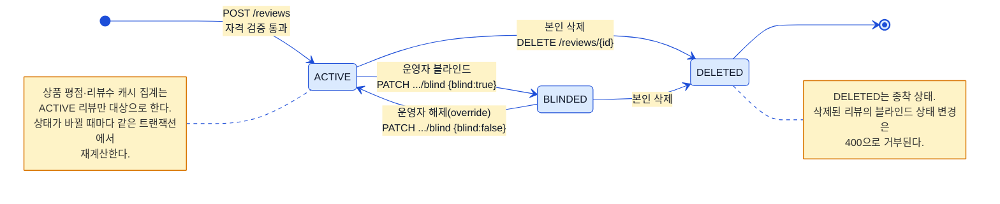
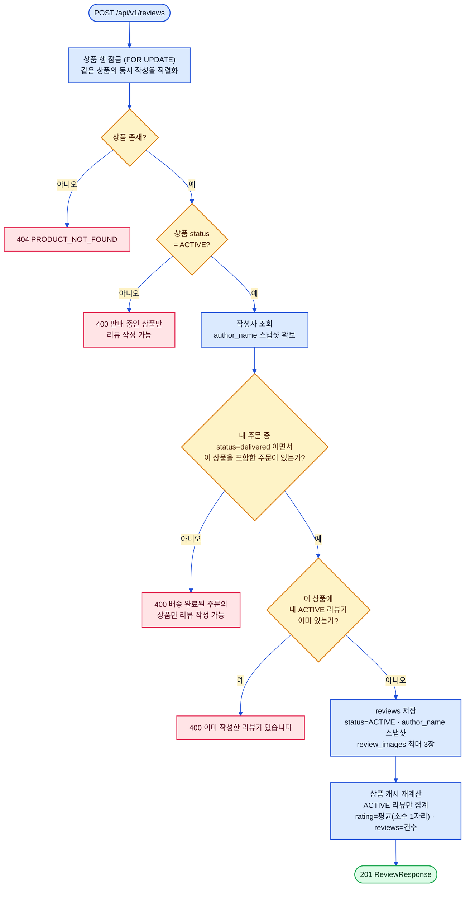

# 리뷰 플로우 (Review Flow)

> 상태: ✅ 확정 · 최종수정: 2026-08-02

리뷰 상태 라이프사이클과 작성 자격 검증 두 갈래를 다룬다.
다이어그램은 `ReviewService`·`AdminReviewController` 구현을 대조해 그렸다.

---

## 1. 리뷰 상태 라이프사이클

상태는 `ACTIVE`·`BLINDED`·`DELETED` 세 개이고, 셋 다 소프트 상태라 행이 사라지지 않는다.
블라인드는 운영자만 걸고 풀 수 있으며, **해제하면 무조건 `ACTIVE`로 돌아간다**. 이 해제는 운영상의 명시적
override라서 같은 사용자·같은 상품에 다른 `ACTIVE` 리뷰가 이미 있어도 그대로 복원한다 — 즉 이 경로로만
한 사용자가 한 상품에 `ACTIVE` 리뷰를 둘 이상 갖는 상태가 생길 수 있다. 삭제된 리뷰는 블라인드 상태를
바꿀 수 없고, 상태가 바뀌는 세 지점(작성·삭제·블라인드) 모두에서 상품 평점 캐시를 다시 계산한다.

> ⚠️ **구현 주의**: 내부 데이터 모델 설계 문서(비공개) §3.6은 리뷰 소프트 삭제 시 연결된 `file_assets`를
> 연쇄 `DELETED` 처리한다고 규정하지만, **서버 코드에 해당 연쇄 로직이 없다**. `review_images`는 현재
> `image_url` 문자열만 갖고 `file_asset_id` 컬럼 자체가 엔티티에 없다.

---

## 2. 작성 자격 검증

검증은 **상품 잠금 → 판매상태 → 구매 이력 → 중복** 순서로 흐르고, 하나라도 걸리면 저장 없이 끝난다.
구매 이력은 `delivered` 주문의 아이템에 그 상품이 있는지로 판정하므로 배송 완료 전에는 리뷰를 쓸 수 없다.
중복 판정은 **`ACTIVE` 리뷰만** 본다 — 이전 리뷰를 삭제했거나 블라인드된 상태면 다시 쓸 수 있다는 뜻이다.
상품 행을 미리 잠그는 이유는 중복 확인과 저장 사이의 경쟁 조건을 막기 위해서고, 같은 이유로 잠금 순서를
어디서나 `Product → Review`로 고정했다. 평점 캐시는 `ACTIVE` 리뷰 평균을 소수 첫째 자리로 반올림해 넣는다.

---

## 3. 리뷰 API

| 메서드 | 경로 | 권한 | 비고 |
|---|---|---|---|
| GET | `/api/v1/products/{id}/reviews` | 공개 | `ACTIVE`만 최신순 |
| GET | `/api/v1/reviews` | 인증 | 본인 리뷰, `DELETED` 제외(= `ACTIVE`+`BLINDED`) |
| GET | `/api/v1/reviews/writable` | 인증 | `delivered` 상품 − 내 `ACTIVE` 리뷰 상품, 판매중인 것만 |
| POST | `/api/v1/reviews` | 인증 | 위 검증 통과 시 |
| DELETE | `/api/v1/reviews/{id}` | 인증 | 본인만, 소프트 삭제 |
| GET | `/api/v1/admin/reviews` | `ADMIN`·`CUSTOMER_SUPPORT`·`SELLER_SUPPORT` | status 필터·페이징 |
| PATCH | `/api/v1/admin/reviews/{id}/blind` | **`ADMIN`·`CUSTOMER_SUPPORT`만** | `{blind: boolean}` |

블라인드 설정·해제는 `admin_audit_events`에 `REVIEW_BLINDED`/`REVIEW_UNBLINDED`로 남는다
(§[`06-ops-flows.md`](06-ops-flows.md)). 리뷰 이미지는 서버가 `^/reviews/....webp$` 형태의 웹 정적 경로
문자열만 최대 3개까지 받는다 — 파일 업로드 경로는 M1 범위 밖이다.
