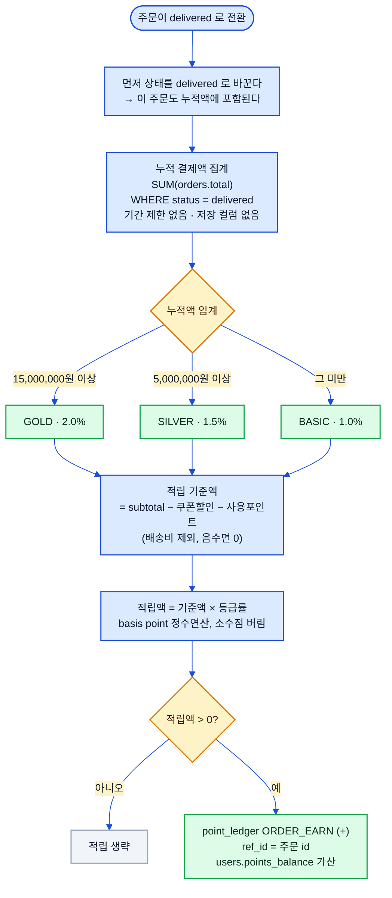
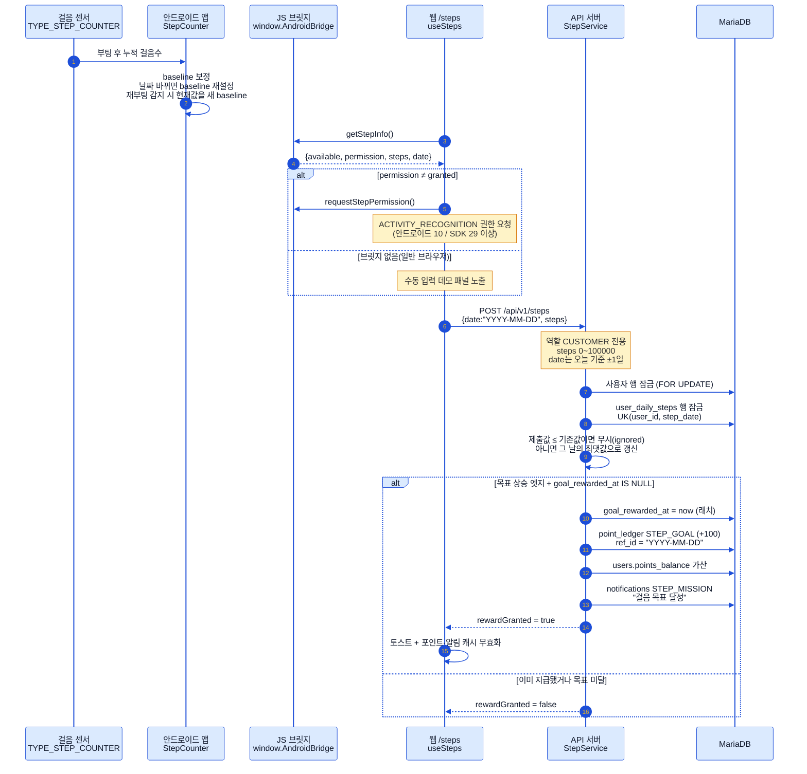
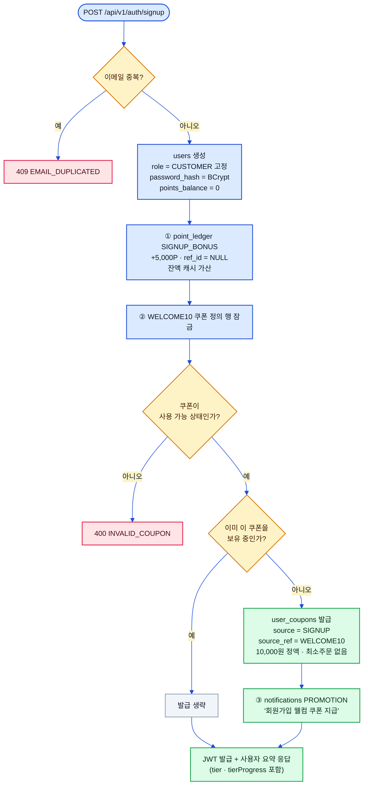

# 리워드 플로우 (Reward Flows)

> 상태: ✅ 확정 · 최종수정: 2026-08-02

멤버십 등급 산정, 만보기 미션, 가입 웰컴 혜택 세 갈래를 다룬다.
포인트는 언제나 `point_ledger` 원장이 진실이고 `users.points_balance`는 같은 트랜잭션에서 갱신되는 캐시다.

> 이미지 버전: [`assets/diagrams/05-reward-flows-1.svg`](assets/diagrams/05-reward-flows-1.svg) · [`-2.svg`](assets/diagrams/05-reward-flows-2.svg) · [`-3.svg`](assets/diagrams/05-reward-flows-3.svg)

---

## 1. 멤버십 등급 산정과 적립

| 등급 | 누적 기준(배송완료 `total` 합) | 적립률 |
|---|---|---|
| `BASIC` | 0원 ~ | 1.0% |
| `SILVER` | 5,000,000원 ~ | 1.5% |
| `GOLD` | 15,000,000원 ~ | 2.0% |

등급은 **저장하지 않고 요청 때마다 집계**한다 — `status=delivered` 주문의 `total` 합계를 전 기간에 걸쳐 더한
값 하나로 결정된다. 적립 기준액은 `total`이 아니라 `subtotal − 쿠폰할인 − 사용포인트`라 **배송비는 적립에서
빠진다**. 계산은 부동소수점 오차를 피하려고 basis point(1/10000) 정수 연산으로 하고 소수점 이하는 버린다.
`delivered` 전환 시 상태를 먼저 바꾸고 등급을 조회하므로 **그 주문 자신도 누적액에 포함**되며, `delivered`
이후에는 취소가 불가능하니 적립을 회수하는 역분개 로직은 필요하지 않다. 등급은 적립률 외에 로그인·내 정보
응답의 `tier`·`tierProgress`로도 노출된다.

---

## 2. 만보기 미션

앱의 역할은 **수집·제공까지**다 — 서버 제출은 로그인 토큰을 쥔 웹이 한다. 앱은 `window.AndroidBridge`라는
JavaScript 인터페이스로 `getStepInfo()`·`requestStepPermission()`을 노출하고, 웹은 브릿지 존재 여부로
앱 안인지 일반 브라우저인지 판단해 브라우저면 수동 입력 데모 패널을 띄운다. 서버는 같은 날짜에 대해
**그날의 최댓값만 유지**하고(제출값이 기존값 이하면 무시), 보상은 "직전엔 목표 미달 → 이번에 목표 달성"이라는
상승 엣지에 `goal_rewarded_at IS NULL` 래치를 더한 네 조건이 모두 맞을 때만 한 번 나간다. 목표 걸음수와 보상
포인트는 행을 만들 때 스냅샷으로 굳어져서, 이후 설정을 바꿔도 이미 만들어진 날짜의 판정 기준은 흔들리지 않는다.

| 설정 키 | 기본값 | 비고 |
|---|---|---|
| `app.steps.zone-id` | `Asia/Seoul` | 오늘 날짜 판정 기준 시간대 |
| `app.steps.daily-goal` | `10000` | 1~100,000 |
| `app.steps.reward-points` | `100` | 1 이상 |

> ⚠️ **구현 주의 2건**: ① 원장 사유는 `STEP_REWARD`가 아니라 **`STEP_GOAL`** 이다(두 값 모두 enum에 존재하나
> `STEP_REWARD`는 미사용). ② `UserCoupon.Source.STEP_MISSION` enum 값은 정의만 되어 있고 **만보기로 쿠폰을
> 발급하는 코드는 없다** — 걸음 보상은 포인트와 알림뿐이다(`Notification.Type.STEP_MISSION`과 혼동 주의).

---

## 3. 가입 웰컴 혜택

가입은 하나의 트랜잭션에서 **계정 생성 → 포인트 5,000P 적립 → `WELCOME10` 쿠폰 발급 → 알림 → 토큰 발급**
순서로 진행된다. 일반 가입으로 만들어지는 계정의 역할은 언제나 `CUSTOMER`로 고정되고, staff 계정은 시드나
별도 발급 경로로만 생긴다. 쿠폰 발급은 정의 행을 잠근 뒤 중복 보유를 확인해서 이미 갖고 있으면 조용히
건너뛴다 — 이 경우 알림도 나가지 않는다. 쿠폰 지갑에 들어오는 경로는 `SIGNUP`(가입)·`CODE_REDEEM`(코드 입력)·
`ADMIN_ISSUE`(시드) 세 가지가 실제로 쓰이고, 주문에 적용 가능한 쿠폰은 **오직 내 지갑에 있는 미사용 쿠폰**뿐이다.

### 포인트 원장 사유

| `reason` | 부호 | 발생 지점 | `ref_id` |
|---|---|---|---|
| `SIGNUP_BONUS` | + | 회원가입 | `NULL` |
| `STEP_GOAL` | + | 만보기 목표 달성 | `YYYY-MM-DD` |
| `ORDER_USE` | − | 주문 생성 시 포인트 사용 | 주문 id |
| `ORDER_EARN` | + | `delivered` 전환 적립 | 주문 id |
| `ORDER_REFUND` | + | 주문 취소 시 사용 포인트 환불 | 주문 id |
| `ADMIN_ADJUST` | ± | 운영 조정(정정용) | — |
| `STEP_REWARD` | — | **미사용**(enum에만 존재) | — |

원장은 append-only라 수정·삭제가 없고, 정정이 필요하면 상쇄 엔트리를 새로 넣는다.
원장 삽입과 `users.points_balance` 갱신은 항상 같은 트랜잭션에서 함께 일어난다.
