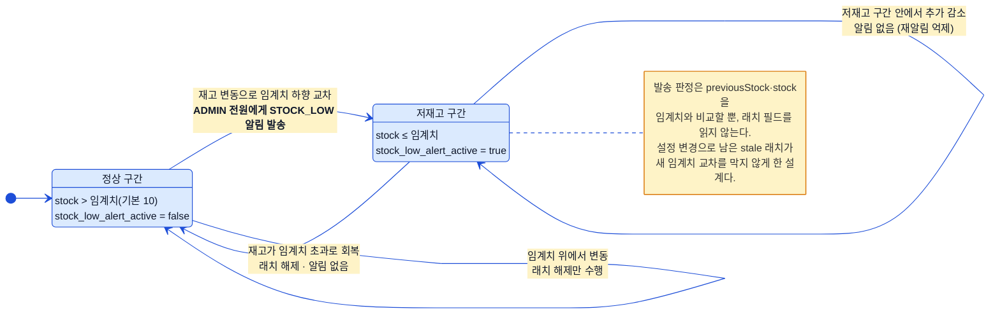
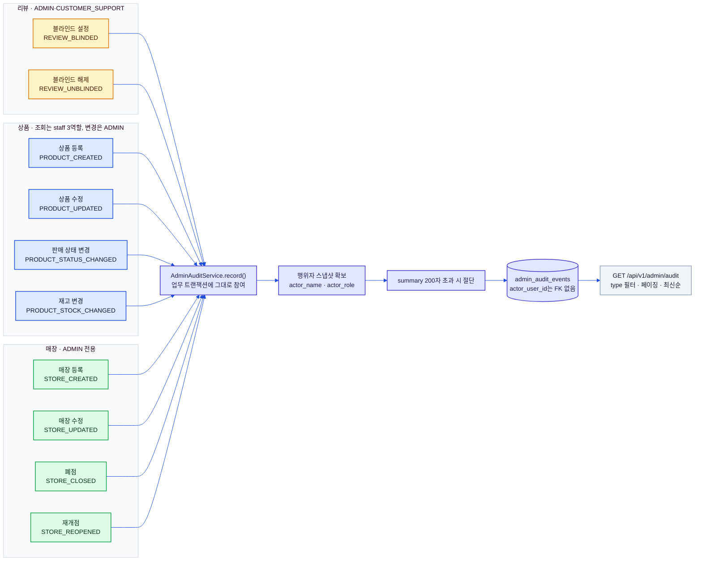
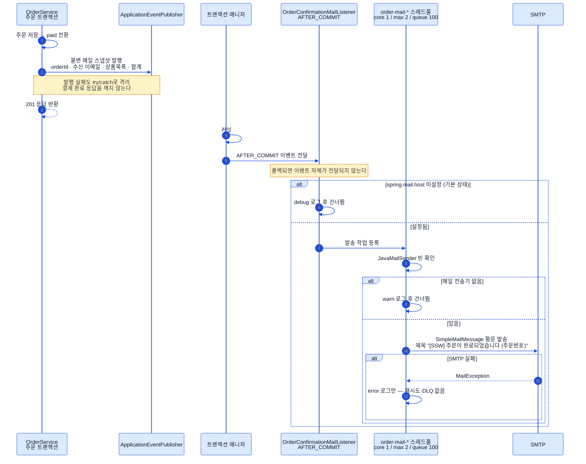
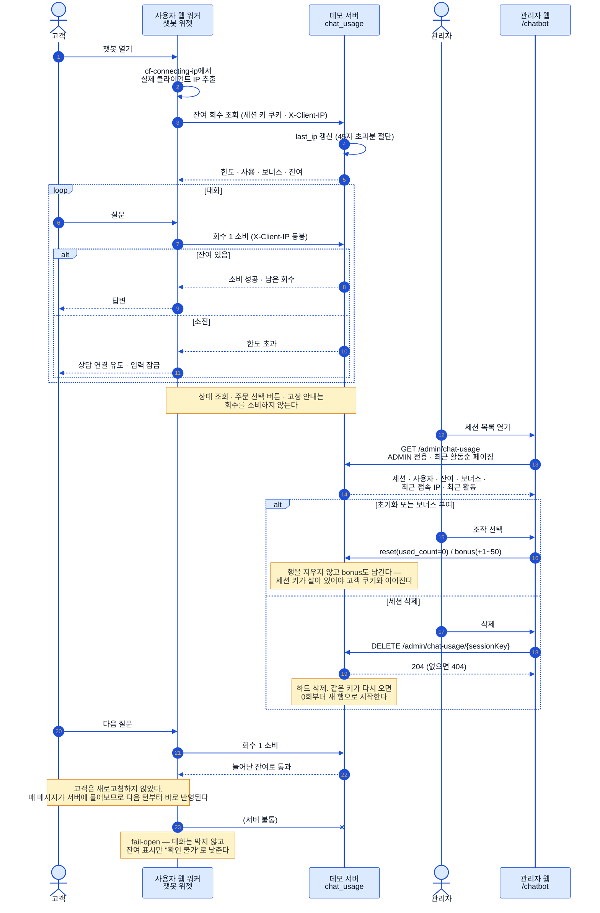
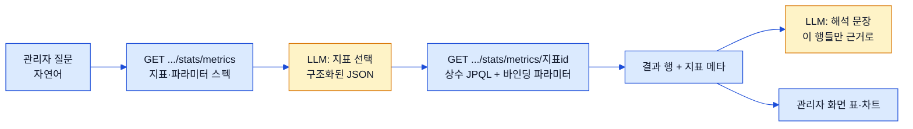

# 운영 플로우 (Ops Flows)

> 상태: ✅ 확정 · 최종수정: 2026-08-06

재고 임계 알림, 관리 행위 감사 기록, 주문확인 메일, 챗봇 대화 회수 관리, 고정 집계 통계 API
다섯 갈래를 다룬다. 앞의 셋은 "업무 트랜잭션에 어떻게 얹히는가"가 핵심이라 트랜잭션 경계를
다이어그램에 같이 그렸고, 넷째는 **관리자 조작이 고객 화면에 언제 도달하는가**가 핵심이라 그
전파 경로를 그렸다. 다섯째는 **LLM에게 무엇을 시키지 않는가**가 핵심이라 질의를 만드는 주체가
어디인지를 그렸다.

---

## 1. 재고 임계 알림 래치

알림이 나가는 순간은 **"직전엔 임계치 위, 지금은 임계치 이하"라는 하향 교차 한 번**뿐이다. 저재고 구간 안에서
재고가 더 줄어도 다시 알리지 않고, 재고가 회복되면 래치만 조용히 풀린다. 여기서 눈여겨볼 점은 래치 필드
`products.stock_low_alert_active`가 **판정에 쓰이지 않는다**는 것이다 — 판정은 오직 이전 재고·현재 재고와
임계치의 비교이고, 래치는 상태 기록 용도로만 쓴다. 임계치 설정을 바꿨을 때 예전 값 기준으로 켜져 있던 래치가
새 임계치의 교차를 삼켜버리는 사고를 막기 위한 의도적 설계다. 알림은 `ADMIN` 역할이면서 `ACTIVE` 상태인
사용자 전원에게 `STOCK_LOW` 타입으로 들어간다(판매지원·고객지원은 대상이 아니다).

| 항목 | 값 |
|---|---|
| 설정 키 | `app.stock-alert.threshold` (기본 `10`, 음수는 기동 시 거부) |
| 호출 지점 | 관리자 상품 수정 · 관리자 재고 변경 · 주문 생성 시 차감 · 주문 취소 시 복원 (총 4곳) |
| 트랜잭션 | `Propagation.MANDATORY` — 호출자 트랜잭션에 반드시 참여, 단독 실행 불가 |
| 알림 | `Notification.Type.STOCK_LOW`, `ref_id` = 상품 id |

> 실제 푸시 전송은 M1 범위 밖이다 — `notifications` 행을 남기는 데까지가 구현 범위다.

---

## 2. 관리 행위 감사 기록

기록되는 행위는 **리뷰 2종 · 상품 4종 · 매장 4종, 합쳐 10종**이다(호출 코드는 9곳 — 리뷰 블라인드
설정/해제가 한 호출문의 삼항 분기라서 그렇다). 기록은 업무 서비스의 기존 트랜잭션에 그대로 참여하므로
업무가 롤백되면 감사 기록도 함께 사라진다 — 일어나지 않은 일이 로그에 남지 않는다는 뜻이다. 행위자
정보는 조회 시점의 `name`·`role`을 **스냅샷으로 복사**해 두고, `actor_user_id`에는 FK를 걸지 않았다.
계정이 삭제돼도 감사 이벤트는 살아남아야 하기 때문이다.

> 주문 상태 변경·문의 답변 같은 다른 관리 행위에는 아직 감사 기록이 붙어 있지 않다.
> 조회 API는 `@PreAuthorize` 없이 `/api/v1/admin/**` 규칙만 타므로 staff 3역할 모두 볼 수 있다.

---

## 3. 주문확인 메일 (AFTER_COMMIT)

주문확인 메일은 **커밋된 뒤에만** 나간다. 트랜잭션이 롤백되면 이벤트가 아예 전달되지 않으므로 "생기지 않은
주문의 확인 메일"이 발송될 여지가 없다. 이벤트에 실는 것은 JPA 엔티티가 아니라 **불변 스냅샷 레코드**라서,
트랜잭션 밖 스레드에서 지연 로딩 사고가 날 일도 없다. 발송은 전용 스레드풀(`order-mail-*`)에 넘겨 비동기로
처리하고, 전 구간이 best-effort다 — 설정 누락·전송기 부재·SMTP 실패 어느 쪽이든 로그만 남기고 조용히 끝난다.
별도 활성화 플래그는 없고 `spring.mail.host` 값이 비어 있으면 비활성인데, 기본값이 빈 문자열이라 **평소 데모
상태에서는 메일이 나가지 않는다**.

| 설정 키 | 기본값 |
|---|---|
| `spring.mail.host` | (빈 문자열 — 사실상의 on/off 게이트) |
| `spring.mail.port` | (로컬 메일 캐처 포트) |
| `app.mail.from` | `no-reply@ssw.local` |

메일 이벤트를 발행하는 곳은 주문 생성 경로 한 곳뿐이다 — 관리자 상태 변경 경로에는 메일이 없고
알림(`notifications`)만 생성된다(§[`03-order-flow.md`](03-order-flow.md)).

---

## 4. 챗봇 대화 회수 관리

대화 회수는 **매 메시지마다 서버에 물어보는 구조**다. 클라이언트가 잔여 회수를 들고 있다가 깎는 방식이
아니라서, 관리자가 값을 바꾸면 **고객이 새로고침하지 않아도 다음 메시지부터 그대로 반영**된다.
푸시도, 폴링도, 소켓도 없이 전파가 즉시인 것은 애초에 클라이언트에 상태를 두지 않았기 때문이다.
관리자가 실시간으로 고객의 남은 회수를 조정하는 장면 자체가 시연 포인트라, 이 전파 지연을 없애는 것이
설계 목표였다.

| 항목 | 값 |
|---|---|
| 기본 한도 | 세션당 10회 (서버 상수 — 바꾸면 기존 세션에도 즉시 적용) |
| 잔여 계산 | `기본 한도 + bonus_count − used_count` |
| 고객용 API | `GET /api/v1/chat-usage/{sessionKey}` 조회 · `POST .../consume` 소비 |
| 관리자 API | `GET /api/v1/admin/chat-usage` · `POST .../{sessionKey}/reset` · `POST .../{sessionKey}/bonus` · `DELETE .../{sessionKey}` |
| 관리자 화면 | 관리자 웹 `/chatbot` — **`ADMIN` 전용** |
| 관리자 조작 | 세션 목록 조회 · **사용 회수 초기화** · **보너스 부여(+1~50)** · **세션 삭제** |
| 클라이언트가 들고 있는 것 | **세션 키 하나뿐**(httpOnly 쿠키, UUID v4, 1시간) — 회수 값은 저장하지 않는다 |
| 접속 출처 | `last_ip` — 고객 웹 워커가 넘긴 `X-Client-IP`, 없으면 서버가 본 remote address |
| 원장 | `chat_usage` (내부 데이터 모델 설계 문서(비공개) §3.18) |

> ⚠️ **관리자 챗봇 화면만 `ADMIN` 전용이다.** `/api/v1/admin/**`의 일반 규칙은 staff 3역할을 통과시키지만,
> 이 네 엔드포인트에는 `@PreAuthorize("hasRole('ADMIN')")`가 따로 붙어 있고 관리자 웹도 같은 조건으로
> 메뉴를 가린다(아니면 대시보드로 되돌린다). 고객의 이용 한도를 조정하는 조작이라 상품·리뷰 관리보다
> 좁게 잡았다.

세션 목록에는 세션 키(축약) · 연결된 사용자(이메일 또는 "익명") · 사용/한도와 잔여 · 보너스 ·
**최근 접속 IP** · 최근 활동 시각이 한 줄로 나오고, 정렬은 **최근 활동순**이다.
방금 대화한 고객을 시연 중에 바로 집어내야 하기 때문이다.

### 4.1 접속 IP는 왜 웹이 실어 보내는가

**서버가 보는 접속 주소가 무의미해졌기 때문이다.** 고객 웹이 Cloudflare Workers에서 돌면서
서버 입장의 remote address는 언제나 클라우드플레어·워커 주소가 된다. 그래서 워커가 자기가 본
실제 클라이언트 IP를 뽑아 `X-Client-IP` 헤더로 넘기고, 서버는 그 값을 `chat_usage.last_ip`에 기록한다.

| 항목 | 값 |
|---|---|
| 우선순위 | `cf-connecting-ip` → `x-forwarded-for` 첫 값 → (둘 다 없으면 헤더를 만들지 않는다) |
| 헤더가 없을 때 | 서버가 본 remote address를 그대로 쓴다 — 로컬 직접 호출 등 |
| 저장 | `VARCHAR(45)`(IPv6 최대 표기) · 초과분은 애플리케이션이 절단 |
| 갱신 시점 | 조회·소비 양쪽 — 회수를 깎지 않는 조회에서도 접속 출처는 갱신된다 |
| 조회의 예외 | **조회만으로는 행을 만들지 않는다.** 이미 있는 세션일 때만 IP를 남긴다 |

> 헤더를 **신뢰 경계로 쓰지 않는다.** `X-Client-IP`는 클라이언트가 위조할 수 있는 값이고, 여기서는
> 관리자 화면에 "이 세션이 어디서 들어왔는가"를 보여주는 **표시용**으로만 쓴다. 인가·차단 판정에
> 관여하지 않으므로 위조되더라도 늘어나는 권한이 없다.

### 4.2 세션 삭제는 초기화와 다르다

초기화(`used_count=0`)는 세션 키를 살려 둔 채 회수만 돌려주지만, **삭제는 행을 하드 삭제**한다.
소프트 삭제 대상이 아니다 — 보존해야 할 "삭제된 상태"가 없는 카운터이기 때문이다.

- 같은 세션 키로 다시 대화가 오면 **0회부터 새 행으로 시작**한다. 이것이 의도된 동작이다.
- 보너스 이력도 같이 사라진다. 그래서 "회수를 되돌려 주는" 용도로는 여전히 초기화를 쓰고,
  삭제는 목록에서 치우는 정리 용도다(시연 사이에 쌓인 세션 정리 등).
- 없는 세션 키를 지우면 404, 성공하면 본문 없이 204다.
- 이 조작은 `admin_audit_events`(§2)에 남지 않는다 — 감사 대상은 리뷰·상품·매장 10종뿐이다.
  대신 행위자와 삭제 직전 사용·보너스 값을 애플리케이션 로그에 남긴다.

**회수를 소비하지 않는 호출**을 구분한 것이 이 설계의 두 번째 축이다. 패널을 열 때의 LLM 상태 조회,
주문 선택 같은 버튼 분기, 고정 안내 문구는 모델을 부르지 않거나 근거 조회만 하므로 회수를 깎지 않는다.
사용자가 "아무것도 안 물어봤는데 회수가 줄었다"고 느끼는 순간 이 제한은 시연 포인트가 아니라 결함이 된다.

> **fail-open은 의도된 선택이다.** 사용량 조회·소비가 실패하면(서버 불통·타임아웃) 대화를 막지 않고
> 그냥 통과시킨다. 잔여 표시만 "확인 불가"로 낮춘다. 회수 제한은 남용 방지가 아니라 **연출 장치**이므로,
> 그것 때문에 시연 중 챗봇이 통째로 멈추는 쪽이 훨씬 큰 손해다. 챗봇 오프라인 폴백
> ([`07-auth-and-chatbot.md`](07-auth-and-chatbot.md) §3)과 같은 원칙이다.

> 초기화는 `used_count`를 0으로 되돌리는 **갱신**이지 행 삭제가 아니다. 행을 지우면 고객 브라우저에
> 남아 있는 세션 키가 어느 행과도 이어지지 않아, 다음 메시지에서 새 행이 생기며 보너스 이력이 끊긴다.

---

## 5. 고정 집계 통계 API — SQL 생성을 버린 자리

자연어 통계 실험실은 원래 **LLM이 SQL을 짓고** 앱 가드로 검사한 뒤 컬럼 단위로 GRANT한
읽기 전용 계정으로 실행하는 2겹 구조였다. 관리자 웹을 Cloudflare Workers로 옮기면서 DB
직결이 성립하지 않게 됐고([`01-system-architecture.md`](01-system-architecture.md) §2.2),
프로덕션에는 그 읽기 전용 계정 자체가 없다. 그래서 데이터 경로만 서버로 옮기는 대신
**구조를 바꿨다.**

**핵심은 LLM이 질의를 만들지 않는다는 것이다.** 고를 수 있는 것은 카탈로그에 있는 지표와
그 지표가 선언한 파라미터뿐이고, 실행되는 질의는 서버가 미리 작성한 상수 JPQL이다.
문자열 연결로 질의를 만드는 코드가 없으므로 주입 표면 자체가 존재하지 않는다.

| 메서드 | 경로 | 권한 |
|---|---|---|
| GET | `/api/v1/admin/stats/metrics` | **`ADMIN` 전용** — 지표 카탈로그 |
| GET | `/api/v1/admin/stats/metrics/{metricId}` | **`ADMIN` 전용** — 지표 실행 |

> ⚠️ **통계 API는 `ADMIN` 전용이다.** `/api/v1/admin/**`의 일반 규칙은 staff 3역할을
> 통과시키지만, 두 엔드포인트에는 `@PreAuthorize("hasRole('ADMIN')")`가 따로 붙어 있다.
> 결과가 외부 LLM 경계로 나가는 데이터라, 관리자 챗봇 화면(§4)과 같은 기준으로 역할을
> 좁혔다.

### 5.1 지표 일곱 개

| 지표 id | 무엇을 세나 | 고유 파라미터 |
|---|---|---|
| `sales_trend` | 결제 총액·주문 수 추이 | `granularity` · `orderStatus` |
| `category_sales` | 카테고리별 상품 판매액·수량 | `categoryLevel` · `orderStatus` · `limit` |
| `order_status_distribution` | 상태별 주문 수·결제 총액(**취소 포함**) | — |
| `top_products` | 상품별 판매액·수량·주문 건수 상위 N | `sortBy` · `orderStatus` · `limit` |
| `low_stock_products` | 판매 중 상품의 저재고·품절 **현재 스냅샷** | `threshold` · `limit` |
| `review_rating_distribution` | 1~5점 리뷰 수(블라인드·삭제 제외) | — |
| `user_signup_trend` | 신규 가입 추이(탈퇴 제외) | `granularity` |

`low_stock_products`를 뺀 여섯은 공통 기간 파라미터(`lastDays` 또는 `from`+`to`)를 받는다.
저재고는 "지금 몇 개 남았나"이지 기간 집계가 아니라서 받지 않는다. 기간은 전 지표
**주문 접수일 기준**이다.

> **매출이 두 종류인 것은 의도된 구분이다.** `sales_trend`·`order_status_distribution`은
> 주문의 결제 총액(`orders.total` — 배송비 포함, 쿠폰·포인트 차감 후)을 쓰고,
> `category_sales`·`top_products`는 주문 항목의 판매액(단가 × 수량)을 쓴다. 배송비·할인은
> 주문 단위 값이라 상품으로 쪼갤 수 없기 때문이다. 두 지표의 합계는 일치하지 않으며, 그
> 사실을 각 지표의 `description`에 적어 해석하는 LLM이 오해하지 않게 했다.

### 5.1.1 `orderStatus` — 취소를 지표가 아니라 조회 옵션으로 본다

"최근 취소가 가장 많이 된 상품이 뭐야"는 처음에 답이 나오지 않던 질문이다. 취소가
`order_status_distribution`의 전체 건수로만 보였고 상품별로 쪼갠 값이 없었다.

**여기서 취소 전용 지표를 새로 만들지 않았다.** 대신 주문·주문항목을 세는 세 지표
(`sales_trend`·`category_sales`·`top_products`)에 집계 대상 상태를 고르는 `orderStatus`를
붙였다. 파라미터 하나로 세 지표가 전부 취소 관점이 되므로 지표를 셋 만드는 것보다 표현력이
넓고, 카탈로그가 얇게 유지된다 — **지표가 늘수록 LLM의 선택 난도와 오선택 확률이 올라간다.**

| `orderStatus` | 집계 대상 |
|---|---|
| `EXCLUDE_CANCELLED` **(기본값)** | 취소를 뺀 네 상태 — 종전 동작 그대로 |
| `ALL` | 취소를 포함한 다섯 상태 전체 |
| `PENDING`·`PAID`·`SHIPPED`·`DELIVERED`·`CANCELLED` | 그 상태인 주문만 |

앞의 질문은 `top_products` + `orderStatus=CANCELLED`로 답한다. `sortBy=QUANTITY`면 취소
수량 순, `REVENUE`면 취소 금액 순이다.

> ⚠️ **상태를 좁히면 열 이름은 그대로지만 뜻이 함께 좁혀진다.** `orderStatus=CANCELLED`로
> 조회한 `top_products`의 "상품 판매액"은 **취소된 금액**이고, `sales_trend`의 "매출"은
> 취소된 결제 총액이다. 지표가 무엇을 세는지는 그대로이고 어떤 주문을 세는지만 달라진다.
> 이 사실을 지표 `description`과 `orderStatus`의 파라미터 설명 양쪽에 적었다 — LLM은 이
> 설명만 읽고 지표와 값을 고르므로, 한쪽에만 적으면 읽지 않는 경로가 생긴다.

기본값이 `EXCLUDE_CANCELLED`라 **파라미터를 주지 않은 호출은 종전과 완전히 같은 결과**를
낸다. 질의도 갈라지지 않는다 — 조건은 `o.status in :statuses` 하나로 고정이고, 열거값을
상태 집합으로 옮기는 Java 분기(`StatsMetric.orderStatusFilter`)가 그 집합을 바인딩
파라미터로 넘긴다. 값에 따라 질의 문자열이 달라지는 코드는 없다.

`order_status_distribution`에는 붙이지 않았다. 그 지표는 상태로 좁혀 보는 것이 아니라 상태
구성 자체를 세는 것이라, 상태 필터는 행을 지우는 것 말고 하는 일이 없다. 주문을 세지 않는
세 지표(`low_stock_products`·`review_rating_distribution`·`user_signup_trend`)도 마찬가지로
받지 않으며, 그쪽에 `orderStatus`를 주면 **400**이다(§5.2).

### 5.2 파라미터 검증 — 무시하지 않고 거부한다

지표 스펙(파라미터 이름·타입·허용값·범위·기본값)은 서버 열거형 하나가 정본이고, **카탈로그
응답과 실행 시 검증이 같은 값을 본다.** 문서와 실제 규칙이 갈라질 수 없는 구조다.

| 규칙 | 위반 시 |
|---|---|
| 카탈로그에 없는 지표 id | 400 — 사용 가능한 id 목록을 메시지에 담는다 |
| 지표가 선언하지 않은 파라미터 이름 | 400 |
| 열거값(`granularity`·`sortBy`·`categoryLevel`·`orderStatus`) 밖의 값 | 400 |
| 기간 상한 **365일** 초과 · `lastDays` 범위 밖 | 400 |
| 상위 N개 상한 **100** 초과 · `limit` 0 이하 | 400 |
| `from`·`to` 한쪽만 지정 · `from`/`to`와 `lastDays` 동시 지정 | 400 |

모르는 파라미터를 **조용히 무시하지 않는 것**이 이 설계에서 가장 중요한 판단이다. 무시하면
LLM은 자기가 건 필터가 걸린 줄 알고 그 전제로 문장을 만든다 — 틀린 숫자보다 틀린 전제가 더
고치기 어렵다. 응답에는 기본값까지 채운 `appliedParameters`와 실제 적용된 `period`를 함께
실어, 해석이 어떤 조건 위에서 나왔는지 화면과 LLM이 같이 볼 수 있게 한다.

주·월 버킷은 DB에서 일별로 집계한 뒤 애플리케이션에서 접는다. 기간 상한이 365일이라 접기
전 행이 366을 넘지 않고, DB별 주차 계산 규칙 차이도 피한다(대시보드의 주문 상태 변경
히트맵이 7×24를 7×8로 접는 것과 같은 방식이다).

> 🚧 **관리자 웹 실험실은 아직 이 API에 붙지 않았다.** 서버 쪽 지표·엔드포인트만 신설된
> 상태이고, 비활성 보관 디렉터리에 남겨 둔 화면을 이 구조에 맞춰 다시 짜는 작업이 남아 있다.
> 시연 대본에서 실험실은 여전히 "보여줄 수 없음"이다
> ([`../demo-scenario.md`](../demo-scenario.md)).
