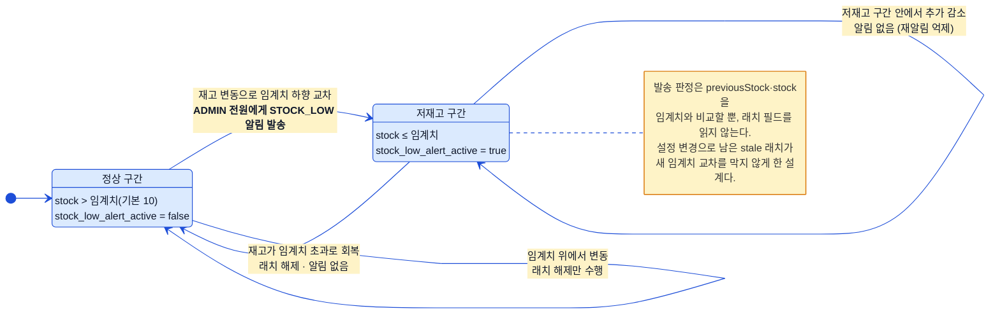
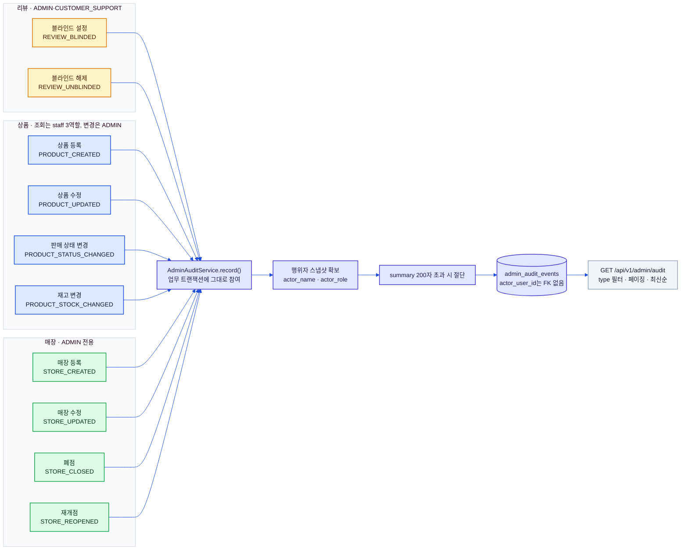
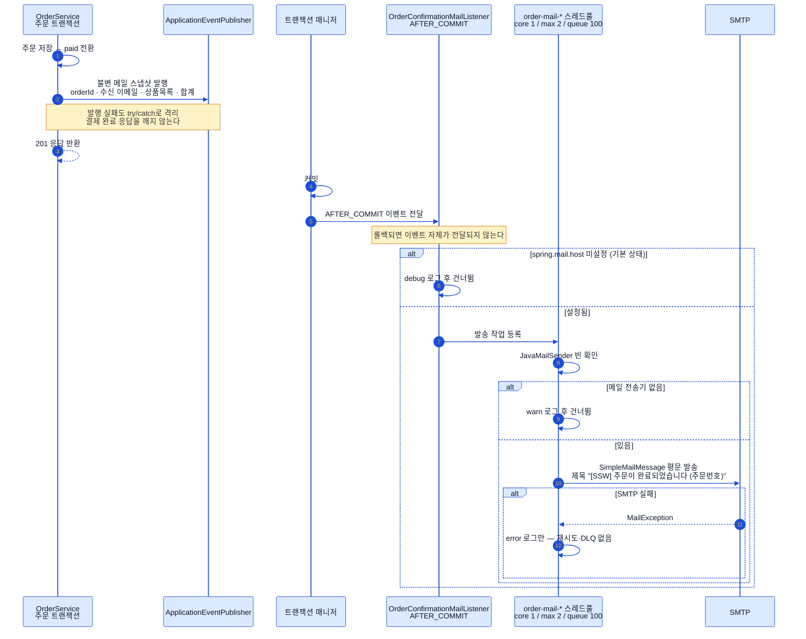
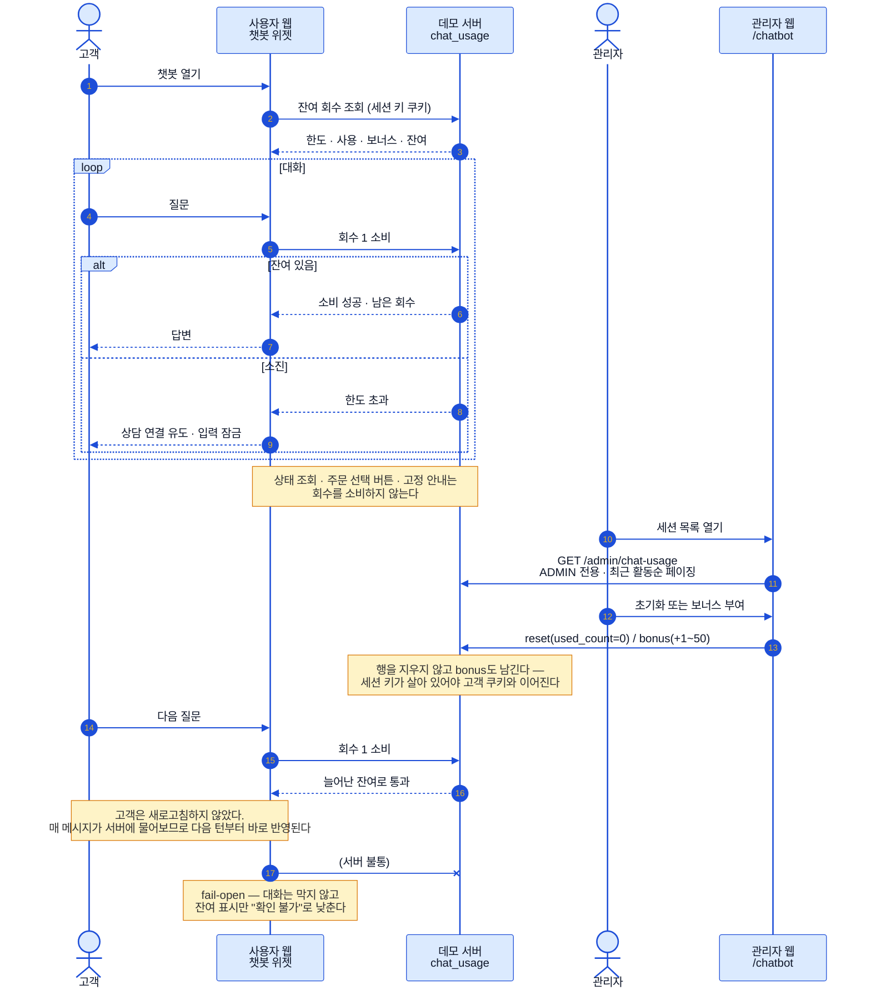

# 운영 플로우 (Ops Flows)

> 상태: ✅ 확정 · 최종수정: 2026-08-05

재고 임계 알림, 관리 행위 감사 기록, 주문확인 메일, 챗봇 대화 회수 관리 네 갈래를 다룬다.
앞의 셋은 "업무 트랜잭션에 어떻게 얹히는가"가 핵심이라 트랜잭션 경계를 다이어그램에 같이 그렸고,
넷째는 **관리자 조작이 고객 화면에 언제 도달하는가**가 핵심이라 그 전파 경로를 그렸다.

---

## 1. 재고 임계 알림 래치

알림이 나가는 순간은 **"직전엔 임계치 위, 지금은 임계치 이하"라는 하향 교차 한 번**뿐이다. 저재고 구간 안에서
재고가 더 줄어도 다시 알리지 않고, 재고가 회복되면 래치만 조용히 풀린다. 여기서 눈여겨볼 점은 래치 필드
`products.stock_low_alert_active`가 **판정에 쓰이지 않는다**는 것이다 — 판정은 오직 이전 재고·현재 재고와
임계치의 비교이고, 래치는 상태 기록 용도로만 쓴다. 임계치 설정을 바꿨을 때 예전 값 기준으로 켜져 있던 래치가
새 임계치의 교차를 삼켜버리는 사고를 막기 위한 의도적 설계다. 알림은 `ADMIN` 역할이면서 `ACTIVE` 상태인
사용자 전원에게 `STOCK_LOW` 타입으로 들어간다(판매지원·고객지원은 대상이 아니다).

| 항목 | 값 |
|---|---|
| 설정 키 | `app.stock-alert.threshold` (기본 `10`, 음수는 기동 시 거부) |
| 호출 지점 | 관리자 상품 수정 · 관리자 재고 변경 · 주문 생성 시 차감 · 주문 취소 시 복원 (총 4곳) |
| 트랜잭션 | `Propagation.MANDATORY` — 호출자 트랜잭션에 반드시 참여, 단독 실행 불가 |
| 알림 | `Notification.Type.STOCK_LOW`, `ref_id` = 상품 id |

> 실제 푸시 전송은 M1 범위 밖이다 — `notifications` 행을 남기는 데까지가 구현 범위다.

---

## 2. 관리 행위 감사 기록

기록되는 행위는 **리뷰 2종 · 상품 4종 · 매장 4종, 합쳐 10종**이다(호출 코드는 9곳 — 리뷰 블라인드
설정/해제가 한 호출문의 삼항 분기라서 그렇다). 기록은 업무 서비스의 기존 트랜잭션에 그대로 참여하므로
업무가 롤백되면 감사 기록도 함께 사라진다 — 일어나지 않은 일이 로그에 남지 않는다는 뜻이다. 행위자
정보는 조회 시점의 `name`·`role`을 **스냅샷으로 복사**해 두고, `actor_user_id`에는 FK를 걸지 않았다.
계정이 삭제돼도 감사 이벤트는 살아남아야 하기 때문이다.

> 주문 상태 변경·문의 답변 같은 다른 관리 행위에는 아직 감사 기록이 붙어 있지 않다.
> 조회 API는 `@PreAuthorize` 없이 `/api/v1/admin/**` 규칙만 타므로 staff 3역할 모두 볼 수 있다.

---

## 3. 주문확인 메일 (AFTER_COMMIT)

주문확인 메일은 **커밋된 뒤에만** 나간다. 트랜잭션이 롤백되면 이벤트가 아예 전달되지 않으므로 "생기지 않은
주문의 확인 메일"이 발송될 여지가 없다. 이벤트에 실는 것은 JPA 엔티티가 아니라 **불변 스냅샷 레코드**라서,
트랜잭션 밖 스레드에서 지연 로딩 사고가 날 일도 없다. 발송은 전용 스레드풀(`order-mail-*`)에 넘겨 비동기로
처리하고, 전 구간이 best-effort다 — 설정 누락·전송기 부재·SMTP 실패 어느 쪽이든 로그만 남기고 조용히 끝난다.
별도 활성화 플래그는 없고 `spring.mail.host` 값이 비어 있으면 비활성인데, 기본값이 빈 문자열이라 **평소 데모
상태에서는 메일이 나가지 않는다**.

| 설정 키 | 기본값 |
|---|---|
| `spring.mail.host` | (빈 문자열 — 사실상의 on/off 게이트) |
| `spring.mail.port` | (로컬 메일 캐처 포트) |
| `app.mail.from` | `no-reply@ssw.local` |

메일 이벤트를 발행하는 곳은 주문 생성 경로 한 곳뿐이다 — 관리자 상태 변경 경로에는 메일이 없고
알림(`notifications`)만 생성된다(§[`03-order-flow.md`](03-order-flow.md)).

---

## 4. 챗봇 대화 회수 관리

대화 회수는 **매 메시지마다 서버에 물어보는 구조**다. 클라이언트가 잔여 회수를 들고 있다가 깎는 방식이
아니라서, 관리자가 값을 바꾸면 **고객이 새로고침하지 않아도 다음 메시지부터 그대로 반영**된다.
푸시도, 폴링도, 소켓도 없이 전파가 즉시인 것은 애초에 클라이언트에 상태를 두지 않았기 때문이다.
관리자가 실시간으로 고객의 남은 회수를 조정하는 장면 자체가 시연 포인트라, 이 전파 지연을 없애는 것이
설계 목표였다.

| 항목 | 값 |
|---|---|
| 기본 한도 | 세션당 10회 (서버 상수 — 바꾸면 기존 세션에도 즉시 적용) |
| 잔여 계산 | `기본 한도 + bonus_count − used_count` |
| 고객용 API | `GET /api/v1/chat-usage/{sessionKey}` 조회 · `POST .../consume` 소비 |
| 관리자 API | `GET /api/v1/admin/chat-usage` · `POST .../{sessionKey}/reset` · `POST .../{sessionKey}/bonus` |
| 관리자 화면 | 관리자 웹 `/chatbot` — **`ADMIN` 전용** |
| 관리자 조작 | 세션 목록 조회 · **사용 회수 초기화** · **보너스 부여(+1~50)** |
| 클라이언트가 들고 있는 것 | **세션 키 하나뿐**(httpOnly 쿠키, UUID v4, 1시간) — 회수 값은 저장하지 않는다 |
| 원장 | `chat_usage` (내부 데이터 모델 설계 문서(비공개) §3.18) |

> ⚠️ **관리자 챗봇 화면만 `ADMIN` 전용이다.** `/api/v1/admin/**`의 일반 규칙은 staff 3역할을 통과시키지만,
> 이 세 엔드포인트에는 `@PreAuthorize("hasRole('ADMIN')")`가 따로 붙어 있고 관리자 웹도 같은 조건으로
> 메뉴를 가린다(아니면 대시보드로 되돌린다). 고객의 이용 한도를 조정하는 조작이라 상품·리뷰 관리보다
> 좁게 잡았다.

세션 목록에는 세션 키(축약) · 연결된 사용자(이메일 또는 "익명") · 사용/한도와 잔여 · 보너스 · 최근 활동 시각이
한 줄로 나오고, 정렬은 **최근 활동순**이다. 방금 대화한 고객을 시연 중에 바로 집어내야 하기 때문이다.

**회수를 소비하지 않는 호출**을 구분한 것이 이 설계의 두 번째 축이다. 패널을 열 때의 LLM 상태 조회,
주문 선택 같은 버튼 분기, 고정 안내 문구는 모델을 부르지 않거나 근거 조회만 하므로 회수를 깎지 않는다.
사용자가 "아무것도 안 물어봤는데 회수가 줄었다"고 느끼는 순간 이 제한은 시연 포인트가 아니라 결함이 된다.

> **fail-open은 의도된 선택이다.** 사용량 조회·소비가 실패하면(서버 불통·타임아웃) 대화를 막지 않고
> 그냥 통과시킨다. 잔여 표시만 "확인 불가"로 낮춘다. 회수 제한은 남용 방지가 아니라 **연출 장치**이므로,
> 그것 때문에 시연 중 챗봇이 통째로 멈추는 쪽이 훨씬 큰 손해다. 챗봇 오프라인 폴백
> ([`07-auth-and-chatbot.md`](07-auth-and-chatbot.md) §3)과 같은 원칙이다.

> 초기화는 `used_count`를 0으로 되돌리는 **갱신**이지 행 삭제가 아니다. 행을 지우면 고객 브라우저에
> 남아 있는 세션 키가 어느 행과도 이어지지 않아, 다음 메시지에서 새 행이 생기며 보너스 이력이 끊긴다.
