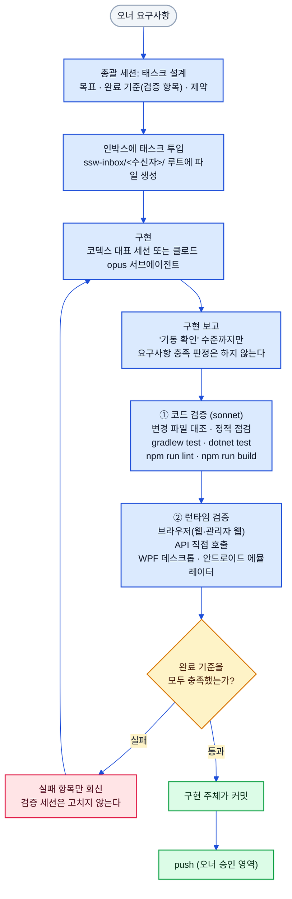
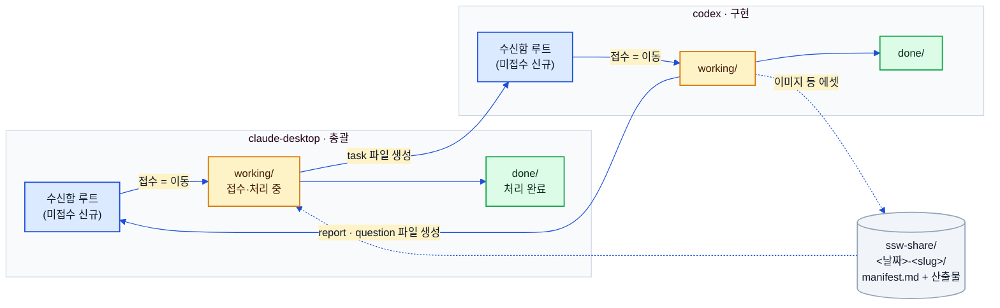

# 검증 파이프라인 (Verification Pipeline)

> 상태: ✅ 확정 · 최종수정: 2026-08-02

이 데모는 여러 에이전트 세션이 나눠 만든다. 그래서 "누가 만들고 누가 판정하는가"를 규약으로 고정해 두었다.
이 문서는 **파일 기반 협업 프로토콜**의 규약과 실제 검증 절차를 다이어그램으로 옮긴 것이다.
(규약 원문과 주고받은 메시지는 로컬 전용 협업 영역에 있어 레포에는 포함되지 않는다.)

---

## 1. 태스크 → 구현 → 검증 → 반영

핵심 규칙은 하나다 — **검증은 구현 주체와 분리한다.** 코덱스가 구현하면 검증은 클로드 측이 맡고, 검증에서
실패가 나오면 검증 세션이 직접 고치지 않고 실패 내용만 구현 주체에 돌려보낸다. 같은 세션이 자기 코드를
검증하면 구현할 때 한 착각을 검증에서도 그대로 반복하기 때문이다. 반대 방향의 제약도 있다 — **구현 보고는
"기동 확인" 수준까지만 적는다.** 요구사항 충족 판정을 구현 쪽이 먼저 내려버리면 검증이 그 결론을 따라간다.
수정이 끝나면 같은 체크리스트로 전체를 다시 돌린다. 수정이 다른 항목을 깨뜨렸을 수 있어서다.

### 레포별 검증 명령

| 레포 | 빌드·실행 | 테스트 | Lint |
|---|---|---|---|
| `-server` | `./gradlew bootRun` | `./gradlew test` | — |
| `-web` | `npm run dev` / `npm run build` | (테스트 스크립트 없음) | `npm run lint` |
| `-admin-web` | `npm run dev` / `npm run build` | (테스트 스크립트 없음) | `npm run lint` |
| `-admin-windows` | `dotnet run --project src/SswEcommerceAdmin.Wpf` | `dotnet test` | — |
| `-android` | `./gradlew assembleDebug` | JVM 단위 테스트(정책 클래스) | — |

`.claude/launch.json`에는 `web`·`admin-web`·`server` 세 항목이 등록돼 있어
런타임 검증은 이 세 개를 띄운 상태에서 진행한다.

> 서버 테스트 클래스 파일은 35개다. **케이스 수는 근거가 엇갈린다** — 서버 README는 97개,
> 인박스 노트는 150개로 적혀 있다. 시점 차이로 보이나 어느 쪽이 최신인지 명시된 갱신 로그가
> 없어 여기서는 두 근거를 병기해 둔다.

---

## 2. 인박스 프로토콜

소통은 오직 파일로 한다. 보내는 쪽은 **상대 수신함 루트에 파일을 만들기만** 하고, 이동·수정·삭제는 수신함
주인만 한다. 받는 쪽이 파일을 자기 `working/`으로 옮기는 행위가 곧 접수(ack)이고, 다 끝나면 `done/`으로
옮긴다. 회신은 원본을 고치지 않고 상대 수신함 루트에 **새 파일**을 만든다 — 보낸 메시지는 절대 수정하지
않는 게 규칙이라 정정도 새 메시지로 한다. 이미지 같은 덩치 큰 산출물은 인박스가 아니라 `ssw-share/`에
태스크 단위 폴더로 두고 `manifest.md`에 목록을 적는데, **매니페스트에 없는 파일은 없는 셈**으로 친다.

### 메시지 형식

파일명은 `YYYYMMDD-HHmm-<from>-<type>-<slug>.md`이고, 프론트매터는 다음과 같다.

| 필드 | 값 |
|---|---|
| `from` / `to` | `claude-desktop` · `codex` |
| `type` | `task` · `report` · `question` · `answer` · `note` · `decision` |
| `title` | 한 줄 제목 |
| `re` | 회신일 때만 — 원본 메시지 파일명 |
| `created` | 절대 표기 `YYYY-MM-DD HH:mm` (상대 표기 금지) |
| `priority` | task 전용 — `low` · `normal` · `high` |

`task` 본문은 **목표 · 배경·컨텍스트 · 요구사항 · 완료 기준(검증 항목) · 제약·주의** 다섯 절로 쓴다.
"완료 기준(검증 항목)" 절이 그대로 검증 체크리스트가 되기 때문에, 이 절이 비면 검증을 위임할 수 없다.
`report` 본문은 **결과 요약 · 변경 내역 · 확인한 것(기동 확인 수준) · 미해결·주의사항** 네 절이다.

---

## 3. 라운드 밖의 검증 산출물

인박스 프로토콜과 별개로, 한 번에 훑는 성격의 검사 결과는 협업 영역 루트에 보고서로 남긴다.

| 파일 | 성격 |
|---|---|
| `code-review-20260801.md` | 코드 품질 검수 집계 (읽기 전용 — 수정 없음) |
| `perf-report-20260801.md` | 엔드포인트별 쿼리 수·응답시간 측정 |
| `qa-sweep-20260802.md` | 최종 QA 스윕, 발견 항목을 SRV/WEB/ADM으로 배분 |
| `layout-changes.md` | 레이아웃 자율 수정 로그 (묻지 않고 고친 뒤 일괄 리뷰) |

협업 영역은 로컬 전용이라 이 보고서들도 레포에 커밋되지 않는다.
