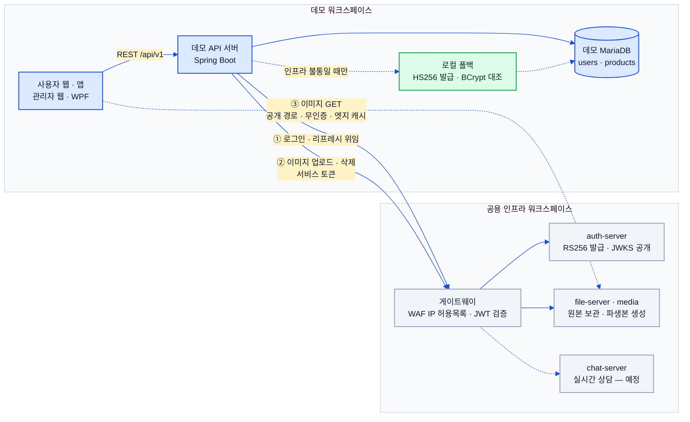
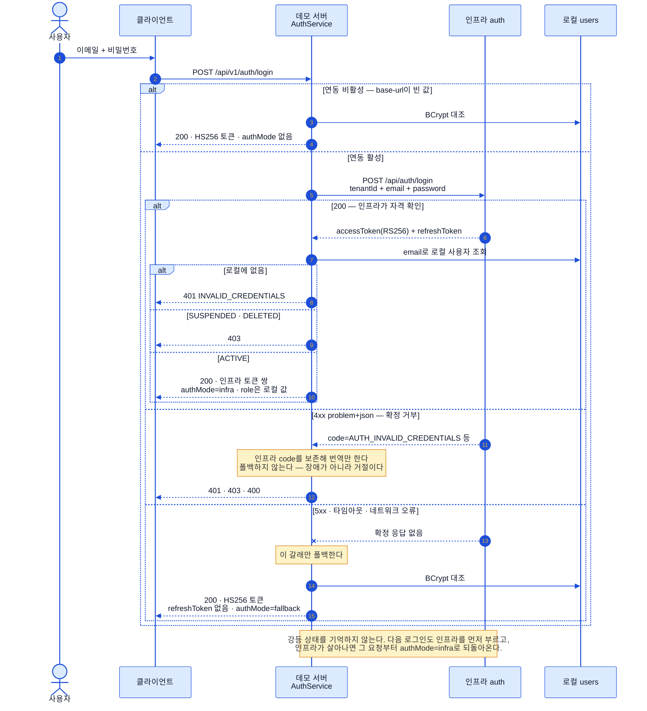
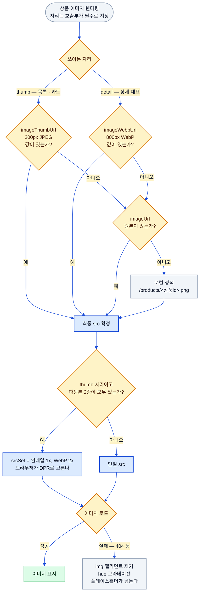
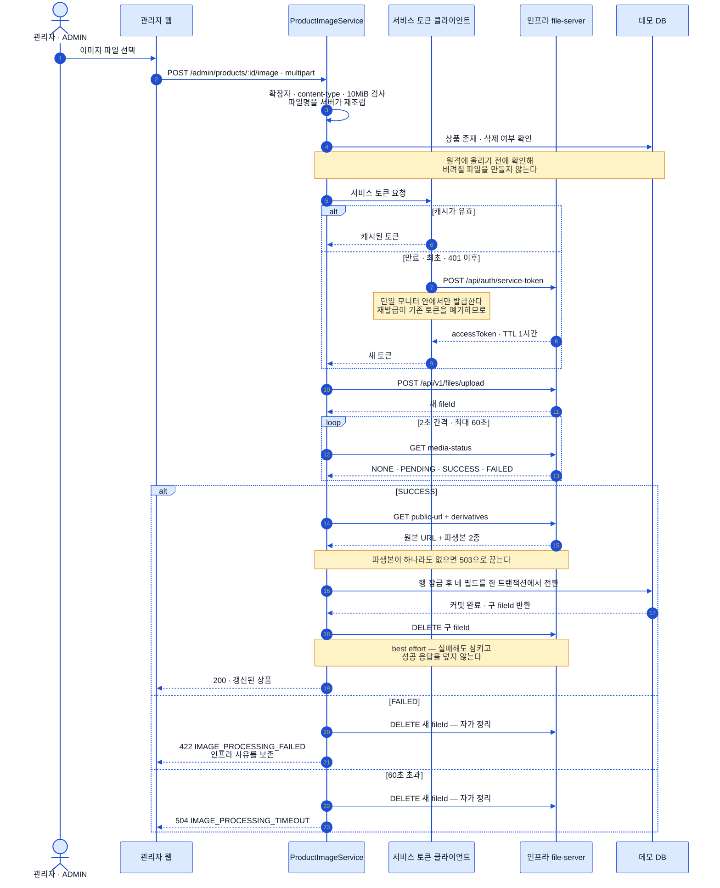

# 인프라 연동 (Infra Integration)

> 상태: ✅ 확정 · 최종수정: 2026-08-04

데모가 SWorkAgency **공용 인프라**에 위임한 두 축 — 인증과 상품 이미지 저장·최적화 — 를 다룬다.
데모 자체 구현이던 것을 인프라로 옮긴 부분이라, [`07-auth-and-chatbot.md`](07-auth-and-chatbot.md) §1(로컬 HS256 JWT)은
**폴백 경로로 남아 있는 서술**로 읽어야 한다. 현재 기본 경로는 이 문서가 정본이다.

> 이미지 버전: [`assets/diagrams/09-infra-integration-1.svg`](assets/diagrams/09-infra-integration-1.svg) · [`-2.svg`](assets/diagrams/09-infra-integration-2.svg) · [`-3.svg`](assets/diagrams/09-infra-integration-3.svg) · [`-4.svg`](assets/diagrams/09-infra-integration-4.svg)

---

## 1. 공용 인프라와의 관계



연동을 관통하는 원칙은 세 가지다.

**1) 인프라와 말을 섞는 것은 데모 백엔드뿐이다.** 인프라 게이트웨이 앞에는 데모 서버 고정 IP와 오너 IP만
통과시키는 WAF 허용목록이 걸려 있어서, 프런트가 인프라를 직접 부르는 순간 이 통제가 무너진다. 최종 사용자가
인프라를 만나는 유일한 지점은 **무인증 공개 이미지 경로(`/public-files/**`)에 대한 GET** 하나뿐이고, 이건
정적 자산을 CDN에서 받는 것과 성격이 같다.

**2) 인증은 인프라, 인가는 데모다.** 인프라가 자격을 확인하고 토큰을 발급하지만, "이 사람이 무엇을 할 수
있는가"는 데모 로컬 `users.role`이 정본이다(§2.3).

**3) 인프라가 죽어도 데모는 산다.** 인증은 로컬 HS256으로 자동 강등되고(§2.5), 이미지는 파생본→원본→로컬
정적으로 자연 강등된다(§3.3). 시연 중 인프라가 멈춰도 화면이 멈추지 않는 것이 설계 목표다.

### 계약 문서

인프라와의 접점은 전부 **계약 문서**로 박제한 뒤 구현한다. 계약 원본은 인프라 측 계약 문서로
관리되고 데모 레포에는 사본을 두지 않는다 — 사본은 반드시 드리프트한다.

| 계약 | 상태 | 범위 |
|---|---|---|
| `ecommerce-demo-auth-delegation.md` | v1.1 · 라이브 | 로그인·가입·리프레시·폐기, 토큰 클레임, 장애 정책 |
| `ecommerce-demo-file-delegation.md` | v1 · 라이브 | 서비스 토큰, 업로드·파생본·삭제, 공개 URL |
| `ecommerce-demo-chat-delegation.md` | draft v0.95 · 설계 중 | 실시간 상담 채팅 (§5) |

---

## 2. 인증 위임

### 2.1 로그인 위임과 폴백 강등



로그인은 인프라에 **자격 검증을 통째로 넘긴다** — 연동이 켜져 있으면 데모는 로컬 비밀번호를 보지 않는다.
대신 인프라가 통과시킨 뒤 곧바로 로컬 `users`를 조회해, 데모가 아는 사용자인지와 계정 상태(`SUSPENDED`·`DELETED`)를
자기 기준으로 다시 판정한다.

이 설계에서 가장 중요한 분기는 **인프라 응답을 "거절"과 "불통"으로 가르는 지점**이다.

| 인프라 응답 | 분류 | 데모 동작 |
|---|---|---|
| 4xx + `problem+json` | 확정 거부 | `code`를 보존해 번역 후 그대로 던진다. **폴백 금지** |
| 5xx | 불통 | 로컬 폴백으로 강등 |
| 타임아웃 · DNS · 커넥션 실패 | 불통 | 로컬 폴백으로 강등 |

비밀번호가 틀린 것과 인프라가 죽은 것을 섞으면, 인프라 장애를 틈타 틀린 비밀번호로 로컬 로그인이 뚫린다.
이 갈림길은 회귀 테스트(`InfraAuthClientErrorMappingTest`)로 못 박아 두었는데, 이 테스트만은 목(mock)이 아니라
실제 HTTP 서버를 띄워 왕복시킨다 — 목으로는 재현되지 않는 함정이 두 개 있었기 때문이다.

> ⚠️ **오류 본문 읽기 함정 두 가지.** ① 오류 본문은 `RestClientResponseException`에서 꺼내야 한다. RestClient의
> 커스텀 `onStatus` 핸들러에서 읽으면 스트림이 이미 소진돼 빈 문자열이 온다. ② HTTP 클라이언트 팩토리를
> `JdkClientHttpRequestFactory`로 고정했다. 기본값인 `HttpURLConnection` 계열은 **401을 인증 챌린지로 취급해
> 본문을 삼켜서**, `AUTH_TOKEN_REVOKED` 같은 코드를 읽을 수 없었다.

회원가입도 인프라에 등록하지만 실패해도 가입 자체는 진행한다. 로컬 `User`는 **인프라 등록 성공 여부와 무관하게
항상 BCrypt 해시를 포함해** 만들어진다 — 그게 폴백의 기반이기 때문이다. 인프라가 불통일 때 만들어진 계정은
로컬 온리로 남고(비밀번호 평문은 그 시점에만 존재하므로 사후 등록이 불가능하다), 경고 로그로 사후 수동 정리 대상이 된다.

### 2.2 토큰 검증 — RS256 + JWKS

검증 경로는 **토큰 헤더의 `alg`만 보고** 갈린다. 서명 검증 전에 JOSE 헤더만 Base64URL 디코드해서
`RS*`면 인프라 경로, `HS*`면 로컬 경로로 보낸다. 두 경로는 완전히 독립이고, 어느 쪽을 타든
`JwtAuthenticationFilter`가 세우는 계약(principal = 로컬 userId, 권한 = `ROLE_역할명` 하나)은 동일하다.

JWKS는 인프라의 `/.well-known/jwks.json`에서 받아 캐싱한다. JWK의 `n`·`e`에서 `RSAPublicKey`를 직접 조립하므로
JWT 라이브러리 외에 추가 의존성은 없다.

| 항목 | 동작 |
|---|---|
| 캐시 TTL | 기본 10분(`jwks-cache-ttl-ms`) |
| kid 미스 | **TTL과 무관하게 즉시 재조회** — 키 회전 대응 |
| 재조회 최소 간격 | 30초(하드코딩) — 미지 kid 폭주가 JWKS를 두드리지 못하게 막는다 |
| 조회 실패 | 기존 캐시를 **그대로 유지**(stale 허용). 인프라 일시 불통에도 검증을 이어간다 |

검증하는 것은 서명 · `exp` · `tokenType == "access"` · `email` 클레임 존재 · 그리고 issuer(조건부)다.
`tokenType` 검사 덕분에 리프레시 토큰으로 API를 부를 수 없다. `aud`와 `nbf`는 인프라가 발급하지 않으므로 검사하지 않는다.

> ⚠️ **구현 주의 — iss 검증은 기본이 꺼져 있다.** `infra-auth.issuer`가 빈 값이면 issuer 검증을 건너뛰는데,
> 코드 기본값이 빈 값이다. 계약 v1.1은 인프라가 이미 `iss`를 발급하고 있다고 못박고 있으므로
> **배포 환경에서 `INFRA_AUTH_ISSUER`를 주입해야 이 검증이 켜진다.** 프로퍼티 클래스 주석은 아직
> "인프라가 아직 iss를 발급하지 않아 기본은 비활성"이라고 적혀 있어 계약보다 낡았다.

> ⚠️ **`tenantId` 클레임은 검증하지 않는다.** 요청을 보낼 때는 테넌트를 실어 보내지만, 받은 토큰의
> `tenantId`는 확인하지 않고 `email`만으로 로컬 사용자를 찾는다. 계약이 유일성을 `(tenantId, email)` 복합으로
> 정의한 것에 견주면 한 겹 약한 매핑이다. 현재 인프라에 데모 외 테넌트가 실질 운용되지 않아 노출은 없지만,
> 테넌트가 늘면 먼저 손봐야 할 자리다.

### 2.3 인가는 데모 로컬 users가 정본

**매핑 키는 `sub`가 아니라 `email`이다.** 인프라 `sub`는 인프라 쪽 `users.id`라서 데모 id와 아무 관계가 없다 —
그걸 principal로 쓰면 남의 주문을 조회하게 된다.

- 로컬 `users`에 없거나 `ACTIVE`가 아니면 **무효 토큰과 똑같이 취급**한다. 자동 프로비저닝은 없다.
- 역할은 로컬 `users.role` 단독이다. 인프라 토큰의 `roles` 클레임은 **디버그 로그로만** 남기고 인가에 쓰지 않는다.
- 자동 생성은 반대 방향으로만 존재한다 — 데모 가입이 로컬 사용자를 만들면서 인프라에도 등록한다.

이 분리는 계약 v1.1의 개정 사항이다. 초기 안은 인프라 `roles`를 그대로 쓰는 것이었는데, 인프라 쪽 `user_roles`
시드가 데모 스태프보다 늦게 들어가면 **관리자가 일시적으로 일반 고객으로 강등**되는 문제가 있었다. 지금은 인프라에
역할 테이블만 만들어 두고 `user_roles` 부여 자체를 하지 않는다 — 비정본 사본은 반드시 어긋나기 때문이다.

### 2.4 리프레시 — rotate-on-use와 single-flight

인프라 액세스 토큰은 1시간, 리프레시 토큰은 14일이고(둘 다 인프라 하드코딩), 리프레시는 **rotate-on-use**다.
한 번 쓰면 그 자리에서 폐기되고 새 쌍이 나온다. 같은 리프레시 토큰을 병렬로 두 번 쓰면 **후발 요청은 무조건
401 `AUTH_TOKEN_REVOKED`** 다.

데모 서버는 받은 리프레시 토큰을 인프라로 중계하고, 응답으로 온 **새 액세스 토큰**을 다시 검증해 사용자를
해석한다(리프레시 토큰에는 `email`이 없어서 그걸로는 사용자를 알 수 없다). 그리고 **리프레시에는 폴백이 없다** —
인프라가 불통이면 503으로 끝난다. 로컬 HS256 세션은 애초에 리프레시 토큰을 발급받지 않으므로 이 경로를 타지 않는다.

직렬화(single-flight)는 **사용자 웹 클라이언트**에 있다. 모듈 스코프에 진행 중인 재발급 `Promise`를 하나 두고,
동시에 401을 받은 요청 전부가 그 하나를 기다린다. 락이 아니라 Promise 공유인 것은 JS가 단일 스레드라서다.

재발급 결과를 세 갈래로 나눈 것이 핵심이다.

| 결과 | 조건 | 처리 |
|---|---|---|
| `refreshed` | 200 + 토큰 있음 | 새 토큰 저장 후 원요청 1회 재시도 |
| `invalid` | 401 · 400 | 리프레시 토큰이 죽었다 → 로그아웃 유도 |
| `unavailable` | 5xx · 네트워크 오류 · 본문 파싱 실패 | **세션을 유지**하고 원요청만 실패시킨다 |

`unavailable`을 따로 뺀 이유는 명확하다 — 인프라가 잠깐 끊긴 것뿐인데 로그아웃시키면, 장애가 끝난 뒤에도
사용자는 다시 로그인해야 한다. 재발급 요청 자체(`/auth/refresh`)와 이미 재시도한 요청은 재귀를 막기 위해
곧장 로그아웃 경로로 보낸다.

> ⚠️ **구현 주의 — 직렬화 범위가 계약보다 좁다.** 계약은 "소비 측(= 데모 서버)이 직렬화할 것"을 요구하지만,
> 실제 직렬화는 한 계층 위인 브라우저에 있고 그마저 **탭 단위**다. 같은 계정으로 두 탭·두 기기가 동시에
> 리프레시하면 후발 쪽이 `AUTH_TOKEN_REVOKED`를 받는다. 서버 측 직렬화는 미구현 상태다.

### 2.5 강등과 복귀 — 상태를 두지 않는다

폴백 설계에서 특징적인 점은 **강등 상태라는 것이 아예 없다**는 것이다. 서킷 브레이커도, 쿨다운도, 헬스체크도,
"지금 폴백 중" 플래그도 없다. 동작은 순전히 요청 단위다 — 매 로그인이 항상 인프라를 먼저 부르고, 그 호출이
불통일 때 그 요청 하나만 폴백한다.

그래서 **복귀는 별도 절차가 아니라 그냥 다음 요청**이다. 인프라가 살아나면 그다음 로그인부터 즉시 `authMode: infra`로
돌아온다. 계약 §6에 실전 기록이 남아 있다 — 2026-08-04 인프라 장애(약 20분) 동안 데모 로그인은 200 + `authMode: "fallback"`으로
계속 동작했고, 복구 후 같은 호출이 `authMode: "infra"`로 돌아왔다. **무개입 자동 강등·복귀 왕복이 실제 장애에서
실증됐고 사용자 차단은 0건**이었다.

대가도 분명하다. **실패를 캐싱하지 않으므로**, 인프라가 완전히 죽어 있는 동안에는 모든 로그인이 커넥트 타임아웃
2초 + 리드 타임아웃 5초를 소모한 뒤에야 폴백한다. 로그인만 느려지고 나머지 화면은 멀쩡하다는 점에서 데모
규모에서는 받아들일 만한 거래다.

강등 중 발급되는 토큰은 HS256이고 `refreshToken`은 `null`이다. 두 종류 토큰은 **동시에 유효**하다 — 검증이
`alg`로만 갈리므로 인프라가 복구돼도 이미 나간 HS256 토큰은 만료(기본 24시간)까지 그대로 통한다. 이건 의도된
것으로, 복구 순간 폴백 세션들을 한꺼번에 끊지 않기 위해서다. 현재 인증 모드는 `authMode` 필드로 로그인 응답과
`/api/v1/auth/me`에 실려 나가고, UI가 폴백 배지를 띄우는 근거가 된다. 연동이 아예 비활성인 구성에서는
`authMode`를 `null`로 내려 "임시 모드"로 오해되지 않게 한다.

### 2.6 설정 키

값은 전부 환경변수로만 주입하며 레포에 두지 않는다. `.env.example`에는 **키 이름만** 있다.

| 키 | 환경변수 | 기본값 |
|---|---|---|
| `infra-auth.base-url` | `INFRA_AUTH_BASE_URL` | 빈 값 — **비면 연동 전체 비활성** |
| `infra-auth.tenant-id` | `INFRA_AUTH_TENANT_ID` | `ecommerce-demo` |
| `infra-auth.issuer` | `INFRA_AUTH_ISSUER` | 빈 값 — 비면 iss 검증 생략 |
| `infra-auth.connect-timeout-ms` / `read-timeout-ms` | 동명 환경변수 | `2000` / `5000` |
| `infra-auth.jwks-cache-ttl-ms` | `INFRA_AUTH_JWKS_CACHE_TTL_MS` | `600000` (10분) |
| `jwt.secret` / `jwt.expiration-ms` | `JWT_SECRET` / `JWT_EXPIRATION_MS` | 폴백 전용. prod에서 시크릿 미주입이면 기동 거부 |

---

## 3. 상품 이미지 파이프라인

### 3.1 세 벌의 URL과 자리별 선택



인프라 file-server에 원본을 올리면 media 쪽이 **파생본 2종**을 만든다. 데모는 상품마다 세 개의 URL을 DB에 들고 있다.

| 필드 | 내용 | 프리셋 | 주 사용처 |
|---|---|---|---|
| `image_url` | 업로드 원본 | — | 파생본이 없을 때의 대체 |
| `image_thumb_url` | 가로 200px JPEG | `default_thumb` | 목록 · 카드 |
| `image_webp_url` | 가로 800px WebP | `webp_optimized` | 상품 상세 대표 |

**클라이언트는 URL을 조합하지 않는다.** 경로 규칙이나 쿼리 파라미터로 파생본을 유도하는 게 아니라, 서버가
완성된 절대 URL 세 벌을 내려주고 리졸버는 **고르기만** 한다. 인프라가 파생본 URL 형태를 바꿔도 데모 프런트는
손댈 필요가 없다.

자리(`variant`)는 호출부가 반드시 지정해야 한다 — 기본값을 두면 새 호출부가 아무 생각 없이 잘못된 크기를
받아가기 때문이다. `next/image` 옵티마이저를 꺼둔 구성이라, **여기서 고른 파생본이 곧 브라우저가 받는 바이트**다.
40px 자리에 800px 이미지가 내려가는 사고를 막는 것이 자리 구분의 목적이다. 반대쪽 파생본은 대신 쓰지 않는다 —
상세 자리에 썸네일밖에 없으면 곧장 원본으로 내려간다.

### 3.2 DPR 대응 srcSet

200px 썸네일은 레티나(2x 이상) 화면에서 뻥튀기돼 흐려진다. 그래서 **thumb 자리에서만, 파생본 2종이 모두 있을 때만**
`"썸네일 1x, WebP 2x"` 형태의 `srcSet`을 만들어 고밀도 화면용 후보로 800px WebP를 함께 제시한다. 브라우저가 밀도에
맞게 고르므로, 저밀도 화면은 여전히 200px만 받는다. 상세 자리는 이미 800px을 쓰므로 `srcSet`을 쓰지 않는다.

### 3.3 자연 강등 사슬

파생본 → 원본 → 로컬 정적(`/products/<상품id>.png`)으로 두 단계 내려앉는 것이 리졸버의 강등 사슬이다.
파일서버가 멈춰 있거나 파생본 생성이 아직 안 끝난 상태에서도 화면이 깨지지 않게 하는 것이 목적이고,
로컬 정적 이미지는 인프라 연동 이전부터 레포에 있던 그 파일들이다.

> ⚠️ **구현 주의 — 강등은 "값 유무"로 갈리지, HTTP 실패로 갈리지 않는다.** 사슬은 렌더링 시점에 필드 값의
> 존재 여부만 보고 한 번에 결정된다. **파생본 URL이 존재하는데 그 요청이 404로 실패하는 경우는 다음 후보로
> 재시도하지 않는다** — 실패한 ``를 화면에서 제거하고, 그 아래 항상 깔려 있는 hue 그라데이션
> 플레이스홀더가 드러난다. 화면이 깨지지 않는다는 목표는 지켜지지만, 파일서버가 URL을 응답하지 못하는
> 상황에서 원본으로 되짚어 가는 동작은 없다.

> 관리자 웹에는 별도의 더 단순한 리졸버가 있다(썸네일 → 원본 → WebP 순, `srcSet`·로컬 폴백 없음, 없으면
> "이미지 없음" 텍스트). 자리 구분이 필요 없는 단일 미리보기 용도라 사용자 웹과 코드를 공유하지 않는다.

### 3.4 시드 이미지 업로드 원장

상품 50종의 이미지를 인프라로 올리는 것은 일회성 작업이지만, **업로드 API가 멱등이 아니라는 점**이 문제였다 —
같은 파일을 두 번 올리면 그냥 두 개가 생긴다. 그래서 스크립트가 직접 멱등성을 만든다.

| 산출물 | 역할 |
|---|---|
| `db/seed-images/product-image-uploads.json` | **업로드 원장.** 파일명별 `productId` · `fileId` · 공개 URL · 크기 · 업로드 시각 |
| `db/seed-images/product-image-urls.sql` | 원본 URL `UPDATE` 문 |
| `db/seed-images/product-image-derivative-urls.sql` | 파생본 URL `UPDATE` 문 |

원장 규칙은 세 가지다. **①** 업로드가 성공할 때마다 즉시 원장에 적고 저장한다(중간에 죽어도 거기까지는 남는다).
**②** 재실행 시 원장에 `fileId`와 URL이 이미 있는 파일은 건너뛴다. **③** 원장을 읽지 못하거나 원장의 `baseUrl`이
이번 실행과 다르면 **중단한다** — 손상된 원장으로 중복 업로드하거나, 개발 원장으로 운영에 올리는 사고를 막는다.

파생본 URL 수집은 별도 스크립트가 맡는다. 이쪽은 조회 전용이라 그 자체로 멱등이고, 매 실행마다 전체를 다시
조회해 산출물을 통째로 갈아엎는다. 파생본 생성이 비동기라 "지난번엔 비었는데 이번엔 있다"가 정상 경로이기 때문이다.

두 스크립트 모두 **DB에 직접 쓰지 않고 `UPDATE` SQL만 만든다.** 운영 프로파일이 `ddl-auto=validate`이고 스키마
변경을 마이그레이션 파일 수동 적용으로 관리하는 이 레포의 관례([`01-system-architecture.md`](01-system-architecture.md) §2.6)를
데이터 백필에도 그대로 적용한 것이다. `products.file_id` 백필 마이그레이션은 원장의 매핑 50건을 SQL 안에
박아 넣고 **`file_id`가 비어 있는 행만** 채우도록 짜여 있다 — 관리자가 이미 교체한 이미지를 시드 값으로 덮지 않기 위해서다.

---

## 4. 관리자 이미지 업로드

### 4.1 서비스 토큰

관리자 업로드는 사람 계정 토큰이 아니라 **서비스 토큰**으로 나간다. 데모 서버가 클라이언트 자격증명으로 직접
받아오는 별도 토큰이고, 클레임에 `roles=SERVICE` · `aud=file-server`가 들어간다. 전용 클라이언트를 따로 둔 이유는
발급 시맨틱이 특이해서다.

> **같은 클라이언트로 재발급하면 기존 발급 이력이 폐기된다.** 그래서 토큰을 캐싱하고, 발급 호출은 반드시
> 직렬화해야 한다. 직렬화하지 않으면 동시에 발급된 토큰들이 서로를 무효화한다.

- **TTL 캐싱** — 인프라 TTL은 1시간. 만료 판정에 60초의 여유 마진(skew)을 두되, **마진은 TTL의 절반을 넘지 못하게**
  상한을 건다. 짧은 TTL이 내려왔을 때 캐시가 발급 즉시 무효가 되는 것을 막기 위해서다.
- **single-flight** — 모니터 객체 하나 + `volatile` 캐시의 이중 검사 잠금(double-checked locking). 캐시가 만료된
  순간 동시에 몰린 요청도, 401을 동시에 받은 요청들도 발급은 정확히 1회다.
- **401 재발급** — 401을 받으면 토큰을 한 번 갱신하고 **같은 요청을 1회만** 재시도한다. 이때도 "이미 다른
  스레드가 갱신한 새 토큰"이 있으면 그걸 재사용하고 발급하지 않는다.
- **네트워크 오류·5xx는 재시도하지 않는다** — 업로드는 응답이 유실됐을 뿐 서버에는 파일이 생겼을 수 있어서,
  재시도가 곧 중복 파일이다.

동시성은 실제 HTTP 서버를 띄우고 12스레드를 동시 출발시키는 테스트로 검증한다 — 최초 동시 요청, 같은 401
토큰의 동시 강제 갱신, 캐시 만료 후 동시 요청 세 가지 모두 발급 1회를 단언한다.

### 4.2 동기 교체 패턴



인프라에는 **교체 API가 없다.** 그래서 "새로 올리고 → 다 익을 때까지 기다렸다가 → 레코드를 갈아끼우고 →
구 파일을 지운다"는 순서를 데모가 지키는 것이 계약이다. 이 순서여야 **사용자 관점에서 404 창이 생기지 않는다** —
레코드가 새 URL을 가리키는 순간 그 URL은 이미 파생본까지 준비된 상태고, 구 URL은 아직 살아 있다.

파생본 생성은 비동기라 **폴링으로 기다린다**. 2초 간격, 최대 60초(계약 권장값 그대로). 타임아웃은 그냥
진행하지 않고 **504로 실패시킨다** — 파생본 없는 URL로 레코드를 바꾸면 목록 이미지가 통째로 사라지기 때문이다.
타임아웃이 0이어도 상태 조회는 최소 1회 수행한다.

**트랜잭션 경계가 이 설계의 핵심이다.** 업로드 서비스 메서드 전체에는 `@Transactional`이 **없다** —
수십 초 걸릴 수 있는 원격 왕복을 DB 트랜잭션 안에 넣으면 커넥션과 행 잠금을 그동안 붙들고 있게 된다.
DB 트랜잭션은 별도 클래스의 짧은 두 메서드(교체·해제)에만 있다.

원자성은 세 겹으로 보장된다. **①** 트랜잭션 메서드 안에 원격 호출이 하나도 없다. **②** 상품 행을
`PESSIMISTIC_WRITE`로 잠그고 읽어 동시 교체를 직렬화한다. **③** 도메인 메서드가 `file_id`·원본·썸네일·WebP
**네 필드를 함께** 세팅하므로 더티 체킹이 단일 `UPDATE`로 플러시한다. 세 URL이 서로 다른 세대를 가리키는
중간 상태가 존재할 수 없다.

**정리 작업은 전부 best effort다.** 구 파일 삭제는 두 겹으로 예외를 삼키고 경고 로그만 남긴다 — 원격 삭제가
실패한다고 이미 커밋된 교체를 되돌리거나 성공 응답을 오류로 바꾸면 안 되기 때문이다. `DELETE`의 404는 멱등
성공으로 취급한다.

반대로 **실패 시 자가 정리**는 새로 올린 파일만 겨눈다. 레코드 전환이 커밋되기 전에 어떤 예외가 나든
방금 올린 `fileId`를 지우고 원래 예외를 그대로 다시 던진다. 커밋된 뒤에는 남은 작업이 구 파일 삭제뿐이고
그건 삼켜지므로, **커밋된 상태가 되돌려지는 경로가 없다.**

상품 소프트 삭제도 같은 원칙을 따른다. 삭제 트랜잭션이 커밋된 **뒤에만** 이벤트가 전달되고, 인프라 파일 정리는
best effort로 남는다.

### 4.3 파일명 정규화와 입력 제한

인프라 업로드는 파일명을 `^[\w\-. ]+$`로 제한한다. 한글 파일명(`상품 사진.JPEG`)이 그대로 올라가면 거부된다.
데모는 이걸 필터링으로 풀지 않고 **원본 basename을 통째로 버리고 결정적 패턴으로 재조립**한다.

```
product-<상품id>-<밀리초>.<소문자 확장자>
```

확장자만 마지막 `.` 뒤에서 떼어 소문자로 정규화하고(로케일은 `ROOT` 고정), 나머지는 서버가 만든다. 이러면
사용자가 어떤 파일명을 올리든 결과는 항상 인프라 제약을 만족한다. 통합 테스트가 한글 파일명 입력으로 이 형태를 검증한다.

| 항목 | 값 |
|---|---|
| 허용 확장자 | `jpg` · `jpeg` · `png` · `webp` · `gif` |
| content-type | `image/*`이기만 하면 통과 (확장자와의 일치는 강제하지 않는다) |
| 용량 | 서비스 계층 10 MiB. 컨테이너 한도는 그보다 조금 넓게(11 MB) 두어 오류 문구를 우리가 낸다 |
| 권한 | `POST` · `DELETE` 모두 **`ADMIN` 전용** (지원 역할은 403) |

검증은 인프라를 부르기 **전에** 끝난다 — 확장자·content-type·용량 위반은 원격 호출 0회로 400을 낸다.
업로더 식별을 위해 로그인 관리자 id를 `uploaderId` 파트로 함께 보낸다.

### 4.4 오류 코드

| 코드 | HTTP | 발생 |
|---|---|---|
| `FILE_SERVICE_UNAVAILABLE` | 503 | 토큰 발급·file-server 호출 실패, 파생본 누락, 자격증명 미설정 |
| `IMAGE_PROCESSING_FAILED` | 422 | media 상태가 `FAILED`. 인프라가 준 사유 문자열을 보존한다 |
| `IMAGE_PROCESSING_TIMEOUT` | 504 | 60초 초과. 문구는 "처리 지연 — 잠시 후 재시도" 고정 |

관리자 웹은 이 셋을 그대로 분기한다 — 422는 사유를 노출하며 다른 이미지를 유도하고, 504는 재시도를 안내한다.
업로드가 동기라 정상 응답도 수 초 걸리므로, 진행 중에는 "이미지 처리 중" 스피너를 띄운다.

> 인프라 자격증명(`INFRA_SERVICE_CLIENT_ID` · `INFRA_SERVICE_CLIENT_SECRET`)은 환경변수로만 주입하고 로그에
> 남기지 않는다. 오류 로그에는 상태 코드와 본문 길이만 적는다. 파일서버 관련 설정이 하나라도 비어 있으면
> 이 기능만 비활성이고 앱 기동은 정상이다.

---

## 5. 예정 — 실시간 상담 채팅

인프라 chat-server를 이용한 **1:1 실시간 고객 상담**이 다음 연동 대상으로 합의됐고, 계약이 초안(draft v0.95)
단계에 있다. 앞의 두 축과 달리 WebSocket이라 **고객 브라우저가 인프라 도메인에 직접 접속**하는 형태가 되고
(REST는 종전대로 데모 백엔드가 프록시한다), 챗봇([`07-auth-and-chatbot.md`](07-auth-and-chatbot.md) §2)이 처리하다
상담원 연결로 전환되는 시점에 룸을 만드는 구성이다. 데모 측 구현 착수 기준은 **계약이 v1으로 박제되는 시점**이며,
그 전까지는 인프라 측 선결 조건(WAF 경로 예외, 게이트웨이 CORS 다중 오리진, 상담원 계정·콘솔) 해소를 기다린다.
